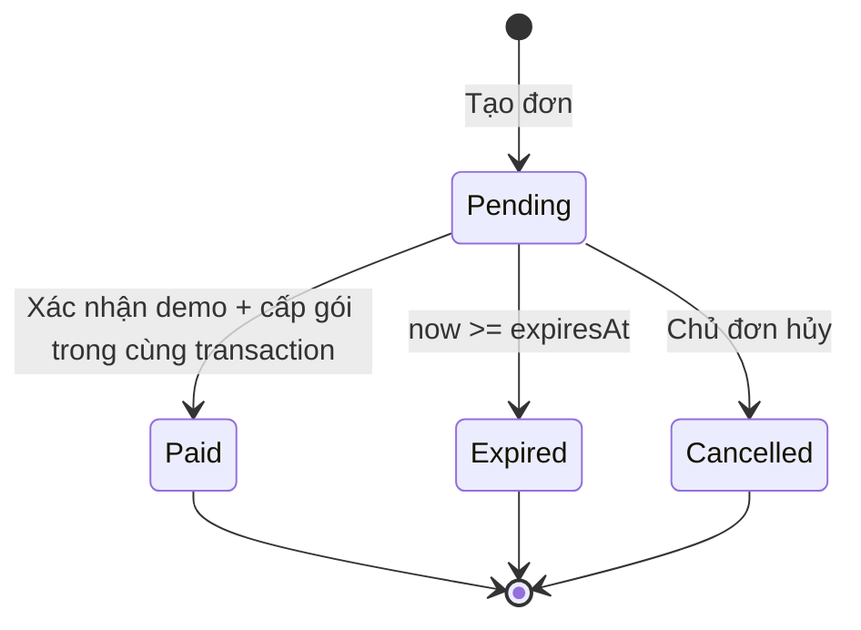

# HomePlant — Kế hoạch Cộng đồng, gói đăng ký và thanh toán QR demo

Ngày khảo sát: 20/09/2026. Trạng thái: **Đề xuất để chủ dự án duyệt; chưa triển khai tính năng.**

Tài liệu này là đặc tả bàn giao cho AI Agent. Giá Silver 48.000đ/tháng và Gold 88.000đ/tháng là yêu cầu đã xác định. Chủ dự án đã chốt giới hạn số cây: **Free 2 cây, Silver 5 cây, Gold 10 cây**. Giá dài hạn, hạn mức AI và các chính sách ghi “đề xuất” bên dưới cần được chủ dự án duyệt trước khi Agent triển khai phần tương ứng.

## 1. Mục tiêu và phạm vi

Hoàn thành ba luồng liên kết với nhau:

1. Người dùng thấy mục **Cộng đồng** trên đầu trang. Hiện chưa có nhóm Facebook nên xem trang giới thiệu “Sắp ra mắt”; khi cấu hình URL nhóm, cùng mục này dẫn tới nhóm Facebook.
2. Người dùng so sánh Free/Silver/Gold, chọn kỳ hạn 1/6/12 tháng, xem gói đang sử dụng và hạn mức còn lại.
3. Người dùng tạo đơn, xem màn hình chuyển khoản QR demo, mô phỏng thanh toán thành công và thấy quyền sử dụng được cập nhật đúng một lần.

Phạm vi MVP gồm giao diện, dữ liệu bền vững, kiểm soát quyền ở backend, kiểm thử, tài liệu cấu hình và bản chạy thử có thể nghiệm thu. Không chỉ dựng trang giá và nút thanh toán.

Chưa đưa vào MVP: mạng xã hội nội bộ, tự động quản lý thành viên Facebook, chuyên gia người thật, tự động trừ tiền định kỳ, hoàn tiền, khuyến mãi/mã giảm giá, thanh toán thật và đổi hạng có tính tiền chênh lệch. Có thể thiết kế điểm mở rộng, không xây trước các hệ thống này.

## 2. Hiện trạng đã kiểm tra

Đã xem trang staging ở `/` và `/Home/Index`, đồng thời đọc mã nguồn local. Chưa đăng nhập, chưa kiểm thử quyền trên staging và chưa xác nhận bản build online trùng hoàn toàn với local.

| Thành phần | Hiện trạng | Hệ quả triển khai |
| --- | --- | --- |
| Nền tảng | ASP.NET Core MVC, .NET 9, Razor, Bootstrap/CSS hiện có | Tiếp tục stack hiện tại; không chuyển SPA hoặc đổi database |
| Trang `/` | Landing tĩnh `3D_UI/index.html`, có chuyển VI/EN | Sửa menu và bản dịch ở đây, không chỉ sửa Razor |
| Ứng dụng `/Home/Index` | Dùng `Views/Shared/_Layout.cshtml` | Bổ sung điều hướng chung cho cả khách và người đã đăng nhập |
| Tài khoản | Firebase Authentication; session `Uid`, `Role`; `ActiveUserFilter` | Giữ cơ chế kiểm tra tài khoản đang hoạt động; không chỉ thêm `[Authorize]` khi chưa cấu hình authentication tương ứng |
| Dữ liệu | Firestore qua server/Admin SDK | Lưu đơn, gói và usage trong Firestore; không dùng session/localStorage làm nguồn quyền |
| Chăm cây | Vườn cá nhân, nhật ký, lịch chăm sóc, nhắc trong ứng dụng và email đã có | Tận dụng tính năng đã chạy để làm quyền lợi gói |
| AI | Gemini phân tích ảnh, kết quả chẩn đoán và khuyến nghị chăm sóc | Phân hạng theo số lượt; không quảng cáo Gold dùng AI tốt hơn khi chưa có khác biệt thực tế |
| Giới hạn AI | Có rate limit theo IP, chưa có quota theo gói/tháng | Cần thêm quota bền vững theo UID; rate limit vẫn giữ vai trò chống spam |
| Cộng đồng cũ | Có model/service và trang admin `community_posts` | Mục Facebook mới không cần phát triển forum hay nối vào collection này |
| Thanh toán | Chưa có catalog gói, đơn, subscription hoặc xử lý thanh toán | Xây mô-đun nhỏ trong ứng dụng hiện tại |
| Render | Cấu hình Free, runtime `ASPNETCORE_ENVIRONMENT=Production` kể cả staging | Không dùng riêng `IsProduction()` để quyết định đây có phải môi trường kinh doanh thật |

Local đang có thay đổi ở `ViewModels/RegisterVM.cs`, `Views/Account/Register.cshtml` và file chưa track `global.json`. Agent phải kiểm tra lại `git status`, bảo toàn công việc có sẵn và không ghi đè/reset chúng.

## 3. Đề xuất sản phẩm để duyệt

### 3.1. Quyền lợi Free / Silver / Gold

| Quyền lợi | Free | Silver | Gold |
| --- | --- | --- | --- |
| Thư viện cây, cẩm nang | Có | Có | Có |
| Truy cập cộng đồng Facebook khi có link | Có | Có | Có |
| Số cây trong vườn | 2 | 5 | 10 |
| Lượt AI phân tích ảnh mỗi tháng | 3 | 30 | 100 |
| Nhật ký và lịch chăm sóc thủ công | Có | Có | Có |
| Nhắc việc trong ứng dụng | Có | Có | Có |
| Nhắc qua email | Có, khi người dùng bật và máy chủ đã cấu hình | Như Free | Như Free |
| Áp dụng lịch chăm sóc từ kết quả AI | Có | Có | Có |
| Xem lại lịch sử và dữ liệu đã tạo | Có | Có | Có |

**Lý do chọn:** Free đủ để người mới trải nghiệm; Silver phù hợp vườn cá nhân; Gold dành cho người có nhiều cây hoặc cần phân tích thường xuyên. Gold cung cấp gấp đôi số cây và hơn ba lần lượt AI của Silver với giá tháng khoảng 1,83 lần. Tránh cam kết “AI không giới hạn” khi chưa đo chi phí thực tế.

Giới hạn số cây đã được chủ dự án chốt; hạn mức AI vẫn là đề xuất ban đầu, chưa phải kết luận về lợi nhuận. Sau demo cần đo chi phí một phân tích thành công, ảnh lưu trữ, email và Firestore trước khi bán thật. Chưa đưa báo cáo nâng cao, tư vấn 1:1, ưu tiên hỗ trợ hoặc nhóm VIP vào bảng quyền lợi vì dự án chưa có dịch vụ tương ứng.

Giữ email và lịch chăm sóc cơ bản cho Free nhằm tránh thu hồi tính năng hiện hữu. Render Free có thể ngủ khi không có truy cập; không quảng cáo email “đúng giờ tuyệt đối” trên hạ tầng demo. [Giới hạn Render Free](https://render.com/docs/free)

### 3.2. Giá đề xuất

| Gói | 1 tháng | 6 tháng trả một lần | Tiết kiệm so với mua tháng | 12 tháng trả một lần | Tiết kiệm so với mua tháng |
| --- | ---: | ---: | ---: | ---: | ---: |
| Silver | **48.000đ** | **259.000đ** | 29.000đ, khoảng 10,1% | **489.000đ** | 87.000đ, khoảng 15,1% |
| Gold | **88.000đ** | **475.000đ** | 53.000đ, khoảng 10,0% | **899.000đ** | 157.000đ, khoảng 14,9% |

- Chỉ giá 1 tháng là yêu cầu đã chốt; giá 6/12 tháng là đề xuất.
- Giá trong bảng là số tiền cuối cùng của đơn demo, đơn vị VND, không thêm phí ở checkout.
- Catalog có 6 mã: `silver_1m`, `silver_6m`, `silver_12m`, `gold_1m`, `gold_6m`, `gold_12m`.
- Cùng hạng có quyền lợi giống nhau ở mọi kỳ hạn. Mua 12 tháng không nhận 12 tháng lượt AI cùng lúc.
- Nếu hiển thị giá quy đổi/tháng, ghi “tương đương”; tổng thanh toán luôn nổi bật. Tính tiền bằng số nguyên VND; không nhân lại giá quy đổi đã làm tròn.
- Thanh toán một lần, gia hạn thủ công. Không ghi “tự động gia hạn”.

### 3.3. Chính sách vòng đời đề xuất

| Tình huống | Quy tắc MVP |
| --- | --- |
| Chưa có gói hoặc đã hết hạn | Quyền Free |
| Free mua Silver/Gold | Có hiệu lực từ lúc xác nhận demo thành công |
| Gia hạn cùng hạng khi còn hạn | Cộng kỳ hạn vào thời điểm hết hạn hiện tại |
| Mua lại sau khi hết hạn | Tính từ thời điểm xác nhận mới |
| Đổi Silver ↔ Gold khi đang còn hạn | MVP chưa hỗ trợ đổi ngay; cho mua hạng khác sau khi hết hạn, nêu rõ trên UI |
| Hết hạn khi có quá 2 cây | Giữ dữ liệu; vẫn xem/sửa/chăm/xóa cây cũ; chặn thêm cây cho đến khi còn dưới giới hạn hoặc mua gói phù hợp |
| Hết lượt AI | Giữ lịch sử, lịch chăm sóc cũ và nhắc việc; chỉ chặn phân tích mới |
| Gói hết hạn giữa lúc AI đang chạy | Lượt đã được backend giữ chỗ hợp lệ được phép hoàn tất; request mới dùng quyền hiện tại |

Đổi hạng tức thì cần một đặc tả riêng về tiền chênh lệch và thời hạn; Agent không tự nghĩ công thức rồi triển khai. Bản MVP vẫn cho trải nghiệm cả hai hạng bằng các tài khoản thử riêng hoặc bằng đồng hồ giả trong test.

Thời hạn subscription dùng tháng lịch, không quy đổi 1 tháng thành 30 ngày: chuyển thời điểm cơ sở sang `Asia/Ho_Chi_Minh`, cộng 1/6/12 tháng theo quy tắc `AddMonths`, rồi lưu UTC. Ngày không tồn tại được chặn về ngày cuối tháng. Khi gia hạn, cộng từ ngày hết hạn đang lưu; chấp nhận quy tắc cuối tháng có thể dịch ngày qua lần gia hạn và kiểm thử rõ. Khoảng hiệu lực là `startsAt <= now < expiresAt`.

Quota AI đề xuất tính theo **tháng dương lịch, múi giờ Việt Nam**, reset lúc 00:00 ngày 1; không cộng dồn. Người mua cuối tháng được hạn mức tháng hiện tại rồi sang tháng mới có hạn mức mới; phải ghi rõ trong FAQ, không gọi đây là chu kỳ 30 ngày. Khi thay đổi quyền trong cùng tháng, giữ số đã sử dụng; hạn mức còn lại bằng `max(0, limit - used - reserved)`.

## 4. Cộng đồng: giao diện và hành vi

1. Thêm **Cộng đồng** và **Gói đăng ký** trên header của landing 3D và navbar ứng dụng. Trên landing thêm bản dịch `Community` / `Plans`.
2. Menu Cộng đồng luôn trỏ tới endpoint nội bộ `/Community`; không để `href="#"` hoặc link Facebook giả.
3. Khi chưa có `Community:FacebookGroupUrl`, `/Community` hiển thị trang giới thiệu ngắn: chia sẻ kinh nghiệm, hỏi đáp về cây, khoe khu vườn; trạng thái “Nhóm Facebook đang được chuẩn bị”. CTA “Tham gia nhóm Facebook” bị vô hiệu hóa rõ ràng.
4. Khi có URL hợp lệ, `/Community` trả redirect 302 tới nhóm. Dùng cùng tab để nhất quán; nếu chủ dự án muốn tab mới, bổ sung `rel="noopener noreferrer"`.
5. Cấu hình chỉ nhận HTTPS, hostname Facebook được cho phép chính xác như `www.facebook.com`/`facebook.com`, đường dẫn `/groups/...`; từ chối URL sai, domain giả và `javascript:`. URL lỗi dẫn tới trang “Sắp ra mắt”, đồng thời log lỗi cấu hình không chứa bí mật.
6. Không tạo nhóm, đăng bài, lấy dữ liệu thành viên hoặc yêu cầu đăng nhập Facebook trong MVP.
7. Kiểm tra mobile menu, focus bàn phím, active state và việc header không che nội dung. Không sửa animation 3D ngoài phạm vi cần cho menu.

## 5. Trang gói và khu vực tài khoản

### Trang `/Plans`

- Mở cho khách chưa đăng nhập; 3 thẻ Free/Silver/Gold và bộ chọn 1/6/12 tháng, mặc định 1 tháng.
- Silver có thể mang nhãn “Đề xuất cho vườn cá nhân”; không gắn “bán chạy nhất” khi chưa có số liệu.
- Hiện số cây, lượt AI/tháng, tổng thanh toán, tiết kiệm và giải thích gia hạn thủ công.
- CTA: Free → “Bắt đầu miễn phí”; Silver/Gold → “Chọn gói”.
- Khách chọn gói → login/register → trở lại trang xác nhận gói đã chọn. Chỉ cho `returnUrl` nội bộ; không tạo đơn qua GET và không tự replay POST sau đăng nhập. Với đăng ký cần xác minh email, cho người dùng tiếp tục lựa chọn sau khi đăng nhập thành công.
- Khi đã đăng nhập: nhận biết gói hiện tại, hiển thị “Gia hạn” cho cùng hạng; thông báo rõ nếu hạng khác chưa thể mua khi còn hạn.
- Sửa câu “hoàn toàn miễn phí” trên landing thành diễn đạt chính xác như “Bắt đầu miễn phí, nâng cấp khi cần”, ở cả VI và EN.

### Trang `/Subscription` và hồ sơ

- Hạng hiện tại, kỳ hạn vừa mua, ngày bắt đầu/hết hạn, trạng thái và nhãn DEMO.
- `Số cây đang có / giới hạn`; `lượt AI đã dùng / giới hạn`; ngày quota reset. Trạng thái quá giới hạn hiển thị rõ, không làm progress bar vượt khung.
- CTA gia hạn; lịch sử đơn của chính người dùng, có phân trang; nút tiếp tục đơn đang chờ.
- Sau xác nhận demo, cập nhật gói ngay từ server; không yêu cầu đăng xuất/đăng nhập lại.
- Lỗi tải trạng thái có nút thử lại; không đổi tạm người dùng thành Free hoặc tự cấp quyền khi Firestore lỗi.

## 6. Thanh toán QR demo: thiết kế và giới hạn cụ thể

### 6.1. Tách hai khả năng

**Mô phỏng thanh toán:** có thể hoàn thành ngay, không cần tài khoản ngân hàng. Đơn có `paymentMode=Demo`, nút **“Mô phỏng thanh toán thành công”** gọi backend. Không ghi “Đã nhận tiền từ ngân hàng”.

**QR ngân hàng quét được:** chỉ tạo khi chủ dự án cung cấp ngân hàng/BIN, số tài khoản và tên người nhận hợp lệ. Có thể dùng VietQR.io Quick Link để mã hóa thông tin từ cấu hình máy chủ và snapshot đơn. Tài liệu nhà cung cấp phân biệt tạo QR và xác nhận thanh toán tự động. [Quick Link](https://vietqr.io/danh-sach-api/link-tao-ma-nhanh/), [Giới thiệu VietQR.io](https://vietqr.io/intro/)

Chưa có tài khoản: hiển thị khung “QR ngân hàng chưa được cấu hình”, giữ toàn bộ luồng mô phỏng hoạt động. Không tự điền tài khoản mẫu từ Internet hoặc bịa người nhận. Nếu dùng ảnh minh họa thì ghi rõ và không tuyên bố đã hoàn thành nghiệm thu QR ngân hàng.

Giai đoạn nghiệm thu QR quét được cần thông tin ngân hàng do chủ dự án chọn. QR chuyển khoản có người nhận thật vẫn có thể dẫn đến giao dịch thật; nhãn DEMO không tạo sandbox ngân hàng. Luồng thử dừng ở đọc thông tin QR, không yêu cầu chuyển tiền. Không dùng QR URL nội bộ rồi gọi đó là QR ngân hàng.

### 6.2. Luồng màn hình

1. Người dùng chọn gói/kỳ hạn, xem tổng tiền và gửi POST tạo đơn.
2. Server kiểm tra tài khoản, mã gói, khả năng mua/gia hạn; lấy giá từ catalog, tạo đơn có hạn 15 phút.
3. Checkout hiện: mã đơn, gói, kỳ hạn, số tiền, ngân hàng/tài khoản/tên người nhận nếu đã cấu hình, nội dung chuyển khoản, QR hoặc trạng thái chưa cấu hình, thời gian còn lại, nhãn **“DEMO — Không thực hiện chuyển tiền”**.
4. Có nút sao chép số tài khoản/số tiền/nội dung, nút hủy đơn và nút mô phỏng. Không thu ảnh chụp giao dịch trong MVP.
5. Bấm mô phỏng → backend xác nhận nguyên tử → trang kết quả hiện gói và hạn mới. Nút bị disable khi chờ phản hồi nhưng backend vẫn phải chống gửi lặp.
6. Reload/quay lại checkout luôn đọc trạng thái server. Trang thành công không tự cấp gói chỉ dựa vào query string.
7. Đơn hết hạn: không mô phỏng thành công được; cho tạo đơn mới bằng thao tác chủ động. Đơn đã hủy không được dùng lại.

Không cần WebSocket hay polling liên tục cho simulator trong cùng trang. Sau POST hoặc khi focus lại trang, tải trạng thái; nếu thêm polling để đồng bộ tab thì tối thiểu vài giây/lần, dừng khi terminal/tab ẩn, có backoff và giới hạn request.

### 6.3. State machine



Lỗi tải ảnh QR hoặc lỗi mạng là lỗi thao tác, không tự biến đơn thành Paid. POST lặp trên đơn Paid trả kết quả cũ; không cộng tháng thêm. Hạn đơn là hiệu lực tại HomePlant: một QR chuyển khoản tĩnh không tự ngừng nhận tiền ở ngân hàng khi countdown kết thúc. Luồng thật sau này cần đối soát riêng cho giao dịch đến muộn.

### 6.4. Cấu hình demo phù hợp Render hiện tại

Đề xuất các khóa mới:

| Khóa | Mặc định / ý nghĩa |
| --- | --- |
| `Community:FacebookGroupUrl` | Rỗng cho tới khi có link |
| `Subscriptions:Enabled` | `false` trước rollout |
| `Subscriptions:EnforceLimits` | `false` cho tới khi dữ liệu usage đã chuẩn bị |
| `App:DeploymentStage` | `Production` nếu thiếu; chỉ `Local`/`Staging` cho phép simulator |
| `Payments:Mode` | `Disabled`; đặt `Demo` ở môi trường thử |
| `Payments:DemoEnabled` | `false`; phải bật rõ ràng |
| `Payments:AllowedDemoProjectIds` | Danh sách project thử được phép, cấu hình ngoài code |
| `Payments:OrderExpiryMinutes` | `15` |
| `Payments:Bank:Bin`, `AccountNumber`, `AccountName` | Rỗng cho tới khi chủ dự án cung cấp |

Simulator chỉ hoạt động nếu đồng thời đúng deployment stage, `Mode=Demo`, demo flag, project thử/emulator được cho phép và tài khoản đang hoạt động. Server có `ASPNETCORE_ENVIRONMENT=Production` nhưng `App:DeploymentStage=Staging` vẫn có thể chạy demo khi các điều kiện còn lại đúng. Khi deployment stage là Production thật, endpoint simulator bị chặn dù gọi trực tiếp hoặc sửa request.

Đây là rào chắn cấu hình, không phải xác thực bằng hostname do browser gửi. Thiếu/sai cấu hình phải từ chối thao tác và hiện thông báo thích hợp. Đơn, subscription demo và audit đều đánh dấu rõ; không tính vào doanh thu thật.

`EntitlementService` cũng phải kiểm tra nguồn demo: một subscription `isDemo=true` không cấp quyền trả phí trên deployment Production thật nếu dữ liệu vô tình bị sao chép. Không chỉ bảo vệ endpoint mô phỏng.

## 7. Kiến trúc và hợp đồng dữ liệu

### 7.1. Thành phần nhỏ, trách nhiệm rõ

| Thành phần đề xuất | Trách nhiệm |
| --- | --- |
| `PlanCatalogService` | Catalog bất biến có version: SKU, tier, kỳ hạn, giá, quota |
| `SubscriptionService` | Đọc gói có hiệu lực, tính thời hạn, quy tắc gia hạn |
| `EntitlementService` | Nguồn quyền duy nhất cho service và ViewModel |
| `SubscriptionOrderService` | Tạo đơn, idempotency, truy vấn đơn thuộc UID, hủy/hết hạn |
| `DemoPaymentService` | Xác nhận demo và cấp gói nguyên tử, chống lặp |
| `UsageService` | Counter cây, giữ/trừ/hoàn quota AI |
| `IBankQrService` / triển khai VietQR | Tạo thông tin QR từ cấu hình tin cậy; không xác nhận tiền |
| `CommunityController`, `PlansController`, `SubscriptionController`, `CheckoutController` | HTTP, kiểm tra session, ViewModel và trình bày lỗi |

Agent có thể điều chỉnh tên/gộp lớp nếu giảm trùng lặp, nhưng phải giữ một nguồn giá, một nguồn quyền và một đường kích hoạt gói. Không thêm generic repository/event bus hay microservice chỉ cho demo.

### 7.2. Cấu trúc Firestore đề xuất

| Đường dẫn | Trường chính / vai trò |
| --- | --- |
| `subscriptions/{uid}` | `tier`, `startsAt`, `expiresAt`, `catalogVersion`, `entitlementsSnapshot`, `lastOrderId`, `isDemo`, `updatedAt`, `schemaVersion` |
| `subscription_orders/{orderId}` | `userId`, `sku`, `tier`, `durationMonths`, `amountVnd`, `currency`, `catalogVersion`, `entitlementsSnapshot`, `status`, `createdAt`, `expiresAt`, `paidAt`, `paymentMode`, `isDemo`, `transferReference`, `bankSnapshot`, `activationResult` |
| `users/{uid}/billing_state/current` | Con trỏ `pendingOrderId`, phục vụ giới hạn một đơn đang chờ mỗi người |
| `users/{uid}/order_requests/{keyHash}` | Mapping idempotency key → orderId và hash nội dung yêu cầu |
| `users/{uid}/usage_state/current` | `plantCount`, version phục vụ tạo/xóa đồng thời; `activeAiRequestId` và lease theo UID xuyên tháng |
| `users/{uid}/usage/{YYYY-MM}` | `aiUsed`, `aiReserved`; tháng theo Việt Nam |
| `users/{uid}/ai_requests/{requestId}` | Chu kỳ gốc, hash yêu cầu, trạng thái reserve/completed/released, hạn giữ chỗ, diagnosisId, lease/version |
| `payment_events/{eventId}` | Audit ổn định theo lần xác nhận, orderId, mode, amount, thời điểm xử lý |

Không nhân bản model user thành user Silver/Gold; `Role=admin/user` và `tier=Free/Silver/Gold` là hai khái niệm khác nhau. Admin quản trị vẫn có quyền theo role; dùng tính năng người dùng thì áp cùng quota trừ khi có ngoại lệ được duyệt.

Lưu timestamp UTC, số tiền `long` VND. Subscription không tồn tại khác với lỗi đọc Firestore: thiếu bản ghi → Free; lỗi hạ tầng → lỗi có thể thử lại và không thực hiện thay đổi.

Catalog version được snapshot vào đơn. Khi thanh toán, dùng snapshot đã chốt nếu đơn còn hạn; thay giá catalog không sửa lại đơn cũ. Quyền subscription lấy từ snapshot đã cấp; trong MVP chỉ có một version. Nếu sau này đổi quyền giữa các version, cần chính sách chuyển đổi riêng; không âm thầm áp quyền mới làm giảm gói còn hạn.

Giới hạn một đơn Pending còn hiệu lực cho mỗi UID: tạo lặp cùng SKU trả đơn hiện có; đổi SKU yêu cầu hủy đơn cũ bằng POST trước. Kiểm tra/đổi con trỏ trong transaction để hai tab không tạo hai đơn cạnh tranh. Cùng idempotency key nhưng khác dữ liệu phải trả conflict; retry cùng key luôn trả đúng đơn ban đầu kể cả khi đơn đã terminal.

### 7.3. API/route dự kiến

| Method / route | Quyền và hành vi |
| --- | --- |
| `GET /Community` | Public; trang chờ hoặc redirect Facebook cấu hình sẵn |
| `GET /Plans` | Public; không ghi dữ liệu |
| `GET /Subscription` | UID hiện tại; gói, usage, lịch sử phân trang |
| `POST /Checkout/Create` | UID hiện tại + anti-forgery; body chỉ SKU và request key, server tự tra mọi giá trị |
| `GET /Checkout/{orderId}` | Chủ đơn; thông tin checkout |
| `GET /Checkout/{orderId}/Status` | Chủ đơn; trạng thái tối thiểu, không cache dùng chung |
| `POST /Checkout/{orderId}/SimulateSuccess` | Chủ đơn + anti-forgery + demo gate |
| `POST /Checkout/{orderId}/Cancel` | Chủ đơn + anti-forgery; chỉ hủy Pending còn hợp lệ |

Ưu tiên route attributes rõ ràng nếu URL khác convention hiện có. View khi thiếu login chuyển tới login; JSON thiếu login trả 401, truy cập đơn khác trả 404, xung đột/đơn terminal không hợp lệ trả 409, đầu vào sai trả 400. JSON lỗi có code ổn định và thông báo tiếng Việt. Không chấp nhận UID/role/amount/paid/isDemo do client tự khai làm căn cứ.

`ActiveUserFilter` hiện redirect cả khi tài khoản bị khóa; với các endpoint JSON mới, cần trả JSON 401/403 phù hợp thay vì HTML đăng nhập bị hiểu nhầm là kết quả thanh toán. Giữ hành vi redirect hiện có cho trang HTML.

### 7.4. Xác nhận và kích hoạt nguyên tử

Trong một transaction: đọc order, user đang hoạt động, subscription hiện tại, billing state và event ID ổn định; kiểm tra chủ sở hữu, mode demo, trạng thái và hạn đơn, tính gói mới; sau đó ghi event, Paid order với activation result, subscription và xóa con trỏ Pending tương ứng.

- Đọc xong trước khi ghi. Callback transaction có thể được Firestore chạy lại; không gọi Gemini, QR API, email hay tạo side effect bên ngoài trong callback. [Firestore transactions](https://firebase.google.com/docs/firestore/manage-data/transactions)
- Kiểm tra lại thời gian server ở lần transaction retry; không dùng thời gian client/countdown. Nếu đã Paid thì trả activation result cũ sau khi kiểm tra quyền truy cập.
- Thanh toán và gia hạn phải cùng commit hoặc cùng thất bại; không tồn tại Paid nhưng chưa được cấp gói.
- Double click, refresh, timeout và request đồng thời không cộng hạn hai lần.
- Khi cancel tranh chấp với confirm, chỉ một chuyển trạng thái thắng; không cho Paid chuyển thành Cancelled.
- Email xác nhận thanh toán không cần cho MVP; nếu bổ sung về sau, chạy sau commit hoặc qua outbox, không làm hỏng kết quả thanh toán đã lưu.

## 8. Kiểm soát quyền và quota tại backend

### Số cây

- Kiểm tra sớm trong `PlantController` để tránh upload ảnh vô ích, và kiểm tra quyết định trong `UserPlantService.Add`.
- Tạo cây và tăng `plantCount` trong cùng transaction đọc subscription hiện tại/counter; hai request tranh chỗ cuối chỉ một thành công.
- Mọi đường tạo cây, kể cả từ kết quả AI, phải đi qua service đó.
- `UserPlantService.Update` hiện dùng `SetAsync`, có thể tạo lại document vừa bị xóa. Đổi thao tác cập nhật sang yêu cầu document đang tồn tại/thuộc chủ sở hữu; edit và áp dụng lịch AI không được hồi sinh cây rồi bỏ qua counter.
- Xóa cây và giảm counter nguyên tử; xóa lặp hoặc admin xóa lại không giảm lần hai. Dọn ảnh, notification và nhật ký tại `plants/{plantId}/careLogs` bên ngoài transaction với xử lý retry phù hợp. Lưu dấu công việc cần dọn nếu cần: retry vẫn phải dọn được sau khi document cây đã mất, không bị early-return của `Delete` hiện tại bỏ qua.
- Nếu ảnh đã upload nhưng thao tác tạo cây thất bại do race, dọn ảnh mồ côi theo cơ chế lưu ảnh hiện tại.
- Bản MVP không thêm khái niệm archive cây. Đếm các document cây đang tồn tại, không tính lịch sử chẩn đoán.

### Lượt AI

1. Xác thực UID, input ảnh, cây thuộc chủ sở hữu, cấu hình và consent trước khi giữ quota.
2. Transaction giữ một lượt cho `requestId` và tháng hiện tại nếu `used + reserved < limit`.
3. Gọi AI bên ngoài transaction; tiếp tục giữ giới hạn kích thước ảnh, timeout và chống spam. Đề xuất tối đa một phân tích đang chạy/UID để đơn giản hóa demo. Giữ con trỏ `activeAiRequestId` theo UID trong transaction, không chỉ nhìn reservation của tháng hiện tại; nếu qua đầu tháng vẫn phải thấy tác vụ cũ. Recovery và giải phóng con trỏ dùng request/tháng gốc và đúng lease/version.
4. Kết quả hợp lệ được lưu với diagnosis ID ổn định; cùng transaction đánh dấu request completed, giảm reserved và tăng used đúng một lần.
5. Validation lỗi, AI lỗi/timeout hoặc không lưu được kết quả: không tính lượt thành công; hoàn reservation đúng một lần. Ảnh upload thất bại nhưng kết quả chẩn đoán đã lưu hợp lệ vẫn tính một lượt và hiện cảnh báo như luồng hiện có.
6. Reload/retry cùng requestId trả kết quả đã lưu hoặc trạng thái đang chạy; không gọi lại AI vô điều kiện.
7. Process crash: reservation có lease quá thời gian xử lý tối đa; thu hồi lazily khi có request mới. Dùng version/fencing để tác vụ cũ không commit sau khi lease đã bị thu hồi. Không phụ thuộc cron hay TTL xóa đúng giờ.
8. Request đi qua mốc đầu tháng vẫn ghi/hoàn vào tháng đã reserve; không trừ nhầm tháng mới. Lượt chưa dùng không chuyển sang tháng sau.

Giới hạn gói là dữ liệu Firestore bền vững, không thay bằng rate limiter trong RAM. Nếu thêm rate policy đọc session theo UID, điều chỉnh thứ tự middleware vì hiện tại `UseRateLimiter` chạy trước `UseSession`.

Không đưa nội dung ảnh/câu hỏi/email đầy đủ vào log. Log mã thao tác, orderId/requestId và trạng thái cần cho debug. Chi phí nhà cung cấp phát sinh khi request timeout không đồng nghĩa phải tính lượt cho người dùng; theo dõi riêng để đánh giá kinh tế.

## 9. An toàn dữ liệu, cấu hình và chuyển đổi

1. Kiểm tra Firebase project thực tế trước mọi migration/test có ghi. Dùng emulator cho integration test, staging riêng cho smoke test.
2. `firestore.staging.rules` hiện chặn client trực tiếp, còn `firestore.rules` khác có luật rộng. Không áp rules staging lên project mobile/cũ một cách mù quáng; đảm bảo collection gói, đơn, quota, event chỉ backend được ghi trên project mục tiêu. Admin SDK vẫn cần kiểm tra quyền ở ứng dụng.
3. Không đọc/in/commit service-account key, API key hoặc dữ liệu thanh toán cá nhân. Cấu hình mẫu chỉ chứa tên khóa và placeholder; biến môi trường .NET dùng dấu `__`.
4. User cũ mặc định Free, giữ nguyên cây/lịch sử. Quota AI bắt đầu đếm từ thời điểm bật tính năng, không truy ngược rồi trừ toàn bộ lịch sử cũ.
5. Trước bật quota cây, chạy backfill `plantCount` có dry-run, idempotency và báo số lượng. Trong cửa sổ backfill, tạm chặn create/delete cây cho cả user/admin trên staging để tránh count lệch; sau đó đối chiếu và mở lại. Không xóa cây vượt hạn.
   Với user mới, khởi tạo counter 0 khi provision tài khoản hoàn tất hoặc ở lần tạo cây đầu có điều kiện bảo đảm là user mới. Nếu user cũ thiếu counter, trả lỗi có thể phục hồi/đưa vào luồng sửa counter; không mặc định 0 khi có thể đã có cây. Chặn ghi đúng UID trong lúc sửa và kiểm tra lại trước khi mở ghi.
6. Đổi schema theo hướng thêm field/collection; code mới đọc được user cũ thiếu field. Không batch xóa hoặc seed lại toàn bộ database.
7. Expiry và quota được kiểm tra khi thao tác, không dựa vào background service. Render ngủ/restart không được làm kéo dài subscription hoặc reset usage. [Render Free](https://render.com/docs/free)
8. Session hiện ở bộ nhớ có thể mất khi restart; sau đăng nhập lại phải xem được đơn/gói cũ vì chúng lưu Firestore.
9. Catalog và quyền trong UI cùng lấy từ service/ViewModel; không duy trì một bộ giá JavaScript khác bộ giá backend. Nếu có giá trên landing tĩnh thì chỉ liên kết trang Plans, tránh nhân bản catalog.

## 10. Danh sách file dự kiến tác động

| Nhóm | File / thư mục |
| --- | --- |
| Điều hướng landing | `3D_UI/index.html`, `3D_UI/assets/css/style.css`, `3D_UI/assets/js/i18n.js` |
| Điều hướng MVC | `Views/Shared/_Layout.cshtml`, CSS hiện có trong `wwwroot/css` |
| Trang mới | `Views/Community/Index.cshtml`, `Views/Plans/Index.cshtml`, `Views/Subscription/Index.cshtml`, `Views/Checkout/*` và ViewModel tương ứng |
| Controller mới | Community, Plans, Subscription, Checkout |
| Backend mới | Models cho subscription/order/usage/event; Services tại mục 7 |
| Điểm tích hợp cây/AI | `Services/UserPlantService.cs`, `Controllers/PlantController.cs`, `Controllers/ExpertController.cs`, `Services/AiDiagnosisService.cs` nếu cần lưu nguyên tử |
| Hồ sơ và đăng nhập | `Controllers/ProfileController.cs`, `Views/Profile/Index.cshtml`; Account/Login VM/view/controller cho local returnUrl; phối hợp thay đổi đăng ký hiện có nếu cần |
| Cấu hình | `Program.cs`, `appsettings.Example.json`, `render.yaml`, indexes Firebase và cấu hình emulator có scope rõ |
| QA/tài liệu | `Tests/SubscriptionChecks`, bộ integration test emulator, tài liệu cấu hình/rollout/smoke test |

Không cần sửa cơ chế email thành tính năng trả phí theo bảng quyền lợi đang đề xuất. Không cần sửa trang quản trị community posts. Admin quản lý thanh toán hoặc dashboard doanh thu là hạng mục sau; MVP có audit để kiểm tra qua công cụ backend được phép.

## 11. Kế hoạch triển khai theo chặng

Mỗi chặng cần diff tập trung, kiểm tra phù hợp và cập nhật kết quả trước khi sang chặng phụ thuộc. Ước lượng bên dưới là ngày làm việc kỹ thuật tham khảo, không phải cam kết thời gian chạy của AI.

| Chặng | Công việc | Điều kiện hoàn thành | Ước lượng |
| --- | --- | --- | --- |
| 0. Chốt đặc tả | Duyệt bảng quyền, giá dài hạn, quy tắc kỳ hạn/quota/đổi hạng, chế độ QR | Decision record không còn lựa chọn mâu thuẫn | Phụ thuộc chủ dự án |
| 1. Khảo sát & baseline | Đọc code hiện tại, bảo toàn diff có sẵn, chạy build/checks, xác định project test | Ghi lỗi có sẵn và lệnh tái hiện; không nhầm với lỗi mới | 0,5 ngày |
| 2. Cộng đồng | Hai menu, trang chờ, redirect có cấu hình, VI/EN, responsive | Chưa có link vẫn có trải nghiệm hoàn chỉnh; link hợp lệ dẫn đúng nhóm | 0,5–1 ngày |
| 3. Domain gói | Catalog, duration/entitlement, model, lưu Firestore, clock injectable, test thuần | 6 SKU và các quy tắc thời gian chính xác | 1–1,5 ngày |
| 4. Trang gói & tài khoản | Plans, bảng so sánh, returnUrl an toàn, gói/usage trong tài khoản | Khách chọn → login → tiếp tục; số tiền nhất quán | 1–1,5 ngày |
| 5. Đơn & QR demo | State machine, idempotency, QR adapter, simulator, activation transaction | Demo đầu-cuối; xác nhận lặp không cộng hạn | 1,5–2 ngày |
| 6. Enforcement | Quota cây/AI, reservation recovery, migration counter, tích hợp luồng cũ | Gọi HTTP trực tiếp hoặc request đồng thời không vượt hạn | 1,5–2 ngày |
| 7. QA & bàn giao | Tests, visual/mobile QA, cấu hình staging, smoke test, runbook/rollback | Đạt tiêu chí nghiệm thu, báo rõ phần QR còn thiếu cấu hình | 1–1,5 ngày |

Tổng khoảng **7–10 ngày kỹ thuật**, tùy baseline và độ sẵn sàng môi trường. Có thể làm Cộng đồng song song với domain gói; giao diện Plans làm song song sau khi thống nhất catalog contract. Đơn thanh toán phụ thuộc domain; enforcement phụ thuộc entitlement. Chỉ giao nhiều Agent các vùng file độc lập, chỉ định một người tích hợp `Program.cs`, layout và controller cũ.

## 12. Kiểm thử bắt buộc

### Test thuần: giá, thời hạn và quyền

- Đúng 6 SKU, số tiền nguyên; từ chối SKU/kỳ hạn lạ; client sửa amount không thay giá server.
- Thiếu subscription → Free; còn hạn và đúng thời điểm hết hạn; subscription chưa tới startsAt không có quyền.
- Cộng tháng qua 31/01, tháng 2, năm nhuận; gia hạn trước/sau hết hạn; giữ đúng giờ Việt Nam và UTC.
- Không cho đổi hạng khi còn hạn; cùng hạng gia hạn đúng; catalog snapshot không tự đổi theo giá mới.
- Quota chuyển tháng đúng giờ Việt Nam, không cộng dồn, không reset khi gia hạn/mua gói trong cùng tháng.
- Gói 6/12 tháng cấp đúng quota mỗi tháng, không nhân tổng quota ngay.

### Integration với Firestore emulator / HTTP

- Hai create cùng key chỉ có một đơn; cùng key khác SKU trả conflict; hai tab chỉ có một Pending.
- Người A không xem QR/trạng thái/lịch sử hoặc confirm/cancel đơn của B.
- Tài khoản khóa, session hết hạn, thiếu anti-forgery không thể ghi đơn hoặc cấp gói.
- Confirm lặp/đồng thời/retry sau mất mạng chỉ cấp một lần; confirm tranh chấp cancel/expiry có một kết quả hợp lệ.
- Giả lập lỗi transaction không để order Paid mà thiếu subscription/event.
- Đơn hết hạn/hủy không cấp quyền; reload sau Paid hiện đúng activation result.
- Stage Staging với ASP.NET Production cho phép demo khi đủ cờ; Stage Production thật, sai project hoặc thiếu cờ phải chặn tại backend.
- Hai request tạo cây ở chỗ cuối: đúng một thành công; xóa lặp/admin xóa chỉ trả lại một slot.
- User vượt quota vẫn xem/sửa/chăm/xóa được cây cũ và xem chẩn đoán cũ.
- AI cuối quota, AI lỗi, input sai, double submit, crash/lease recovery, commit cũ sau recovery và request qua đầu tháng đều giữ counter đúng.
- Firestore lỗi không vô tình cấp lượt miễn phí, tạo đơn trùng hoặc coi gói trả phí là Free để làm mất quyền.
- Dữ liệu cũ thiếu field vẫn đọc được; backfill chạy lại không tăng counter.
- User mới được khởi tạo counter đúng; user cũ thiếu counter không thêm cây vượt hạn; lỗi dọn ảnh/careLogs/notifications có thể retry sau khi cây đã xóa mà không giảm counter lại.

### UI và QR

- Menu xuất hiện ở landing và MVC, trước/sau login; landing VI/EN; mobile khoảng 360/390px và desktop.
- Không tràn ngang navbar/bảng giá; focus và nút disabled dễ hiểu; loading/error/empty/expired/success đầy đủ.
- Giá/kỳ hạn giữa Plans → order → checkout → lịch sử trùng nhau; refresh/back không tạo đơn mới.
- Chưa cấu hình ngân hàng: thông báo rõ và simulator chạy được; không có QR giả bị mô tả là ngân hàng.
- Có cấu hình hợp lệ: decode QR kiểm tra ngân hàng, tài khoản, số tiền, nội dung từ đơn; nếu thử ứng dụng ngân hàng thì chỉ xem trước, không chuyển tiền.
- Nội dung chuyển khoản dùng reference ngắn chỉ chữ/số, không dấu, không nhúng email/số điện thoại; tuân thủ giới hạn của nhà cung cấp đã chọn.
- Ảnh QR lỗi hoặc nhà cung cấp không phản hồi: thông tin đơn vẫn hiển thị, có retry; không mất dữ liệu hoặc tự báo thành công.
- Thay đổi cấu hình ngân hàng sau khi tạo đơn không làm QR và thông tin người nhận của đơn cũ bất nhất; dùng `bankSnapshot` của đơn.

### Lệnh baseline/regression hiện có

```sh
dotnet build HomePlant.csproj
dotnet run --project Tests/RegistrationChecks
dotnet run --project Tests/CareScheduleChecks
dotnet run --project Tests/EmailNotificationChecks
npm --prefix Seed test
```

Test hiện tại là các chương trình checks .NET; không giả định chỉ chạy `dotnet test` là đã chạy chúng. Có thể thêm project kiểm thử theo convention hiện tại và test emulator riêng. Ghi hướng dẫn setup emulator chỉ dùng project test, không yêu cầu khóa production. Rà soát script trước khi chạy; không tự chạy `Seed/web_flow_test.js --run` vì luồng này có ghi/xóa dữ liệu và thay trạng thái tài khoản thử.

## 13. Rollout và rollback

1. Build/publish local, chạy baseline và test mới; kiểm tra output publish không chứa secret.
2. Chuẩn bị cấu hình mẫu, indexes cần cho truy vấn lịch sử theo `userId + createdAt`, query đơn theo trạng thái nếu có; không tạo indexes thừa. Áp đúng Firebase staging đã xác định.
3. Deploy bản demo tới staging trong phạm vi được chủ dự án cho phép; để enforcement tắt tới khi chuẩn bị counter xong. Lưu ý đẩy nhánh staging có thể kích hoạt Render auto-deploy.
4. Dry-run/backfill counter, kiểm tra chéo, bật subscriptions/enforcement và simulator bằng cấu hình riêng cho staging.
5. Smoke test bằng tài khoản/fixture thử, không dùng tài khoản người dùng thật và không chuyển tiền.
6. Bàn giao ảnh màn hình, lệnh kiểm thử, kết quả pass/fail, cách đổi Facebook URL/ngân hàng và danh sách cấu hình còn thiếu.
7. Nếu lỗi: tắt tạo đơn/simulator/enforcement bằng cờ vận hành và hiện thông báo bảo trì phù hợp; giữ dữ liệu đơn/gói, không xóa hay reset. Có thể rollback build đã xác định. Khi bật lại phải đối chiếu counter nếu từng cho phép ghi cây lúc enforcement tắt; duy trì cập nhật counter ngay cả khi không chặn hạn mức.

Không tự nâng Render lên gói trả phí, bật thanh toán thật hay thêm bên nhận tiền. Đây là kế hoạch demo; các quyết định đó cần yêu cầu riêng của chủ dự án.

## 14. Tiêu chí nghiệm thu và bàn giao

- [ ] Có Cộng đồng trên cả hai header; chưa có link vẫn mở được trang chờ; thêm URL đúng thì redirect hoạt động.
- [ ] Có Free/Silver/Gold, đủ sáu lựa chọn trả phí, giá đã duyệt, nội dung quyền lợi trung thực.
- [ ] Khách xem Plans, đăng nhập và tiếp tục lựa chọn không bị mất ngữ cảnh.
- [ ] Gói/đơn/usage lưu bền vững, người dùng chỉ truy cập dữ liệu của mình.
- [ ] Mô phỏng thanh toán kích hoạt/gia hạn ngay và đúng một lần; dữ liệu có nhãn demo.
- [ ] Chưa có ngân hàng vẫn có demo hoạt động; **phần QR ngân hàng chỉ được đánh dấu hoàn thành khi cấu hình và kiểm tra decode đạt**.
- [ ] Hết hạn/quota có hiệu lực ở backend, không xóa hoặc làm mất quyền xem dữ liệu cũ.
- [ ] Không vượt hạn bằng double click, nhiều tab, gọi API trực tiếp hoặc sửa payload.
- [ ] Demo không thể chạy ở deployment Production thật; không có secret trong Git/log/publish.
- [ ] Tests quan trọng và regression đạt; các giới hạn môi trường được ghi rõ, không báo pass cho test chưa chạy.
- [ ] Tài liệu cấu hình, migration, indexes, rollout, rollback và báo cáo test có thể dùng lại.

Agent bàn giao: tóm tắt thay đổi; file chính; test đã chạy và bằng chứng; các việc chưa làm/kèm lý do; cấu hình cần chủ dự án cung cấp; hướng dẫn demo từ chọn gói tới kiểm tra hạn mới. Không tuyên bố “thanh toán ngân hàng tự động” khi chỉ có simulator.

## 15. Phiếu duyệt đề xuất

Chủ dự án có thể duyệt nguyên bộ hoặc sửa từng dòng:

| Mã | Quyết định cần duyệt | Đề xuất mặc định |
| --- | --- | --- |
| D1 | Quyền lợi | Số cây đã chốt: Free 2, Silver 5, Gold 10. Chờ duyệt AI: Free 3, Silver 30, Gold 100 lượt/tháng; tính năng nền dùng chung |
| D2 | Giá dài hạn | Silver 259k/6 tháng, 489k/năm; Gold 475k/6 tháng, 899k/năm |
| D3 | Cách tính quota | Tháng dương lịch Việt Nam, không cộng dồn, không reset khi gia hạn |
| D4 | Gia hạn/đổi hạng | Gia hạn cùng hạng; đổi hạng sau khi hết hạn trong MVP |
| D5 | QR demo | Simulator trước; bổ sung QR ngân hàng quét được khi có thông tin người nhận |
| D6 | Phạm vi triển khai | Xây và kiểm thử local; triển khai staging khi chủ dự án giao phạm vi đó; chưa bán thật |

Thông tin sẽ cần sau này: URL nhóm Facebook; ngân hàng/BIN, số tài khoản và tên người nhận nếu muốn nghiệm thu QR ngân hàng. Chưa có những thông tin này không cản trở phần trang Cộng đồng chờ và simulator.

## 16. Prompt giao cho AI Agent sau khi duyệt

```text
Bạn là kỹ sư senior triển khai trên repository HomePlant hiện tại.

Đọc docs/COMMUNITY_SUBSCRIPTION_QR_PLAN.md và quyết định duyệt đính kèm của
chủ dự án. Đây là đặc tả chính. Nếu mới chỉ nhận tài liệu chưa có xác nhận
duyệt, không tự xem các giá/hạn mức đề xuất là quyết định cuối cùng.

Sau khi có quyết định duyệt, hãy triển khai đầy đủ phạm vi được giao theo
thứ tự phụ thuộc ở mục 11. Dùng ASP.NET Core MVC/Razor/Firebase hiện tại.
Đầu tiên kiểm tra git status, đọc hướng dẫn repository và chạy baseline;
bảo toàn mọi thay đổi có sẵn, không reset hoặc viết lại dự án.

Dùng catalog và entitlement phía server làm nguồn sự thật. Xử lý đơn,
cấp gói và quota bằng dữ liệu bền vững; kiểm thử đồng thời, idempotency,
quyền sở hữu và hết hạn. Không chỉ thêm UI hoặc hide button.

Triển khai Cộng đồng trên cả landing 3D và layout MVC. Không có Facebook
URL thì hiển thị trang chờ. Không có tài khoản ngân hàng thì hoàn thành
simulator và thông báo thiếu QR, không bịa tài khoản hoặc giả hoàn thành.

Luồng demo phải được tách bằng config và môi trường dữ liệu; không chuyển
tiền, không bật live payment. Không thay dự án Firebase hay ghi lên dữ liệu
thật chỉ để chạy test. Không sửa giá, quota hoặc chính sách đã duyệt ngầm.

Chia công việc thành các diff nhỏ, chạy test đúng từng phần rồi regression.
Có thể làm các phần độc lập song song, nhưng kiểm soát file dùng chung.
Hoàn thành QA responsive, trạng thái lỗi và các acceptance criteria trong
tài liệu. Không tự triển khai ngoài môi trường/phạm vi đã được giao.

Khi hoàn tất, báo những gì đã làm, file chính, test đã chạy/kết quả, cách
cấu hình và thử nghiệm, việc còn thiếu. Nêu rõ khác biệt giữa QR ngân hàng,
mô phỏng xác nhận và thanh toán thật. Chỉ đánh dấu tiêu chí hoàn thành khi
có bằng chứng kiểm tra tương ứng.
```
