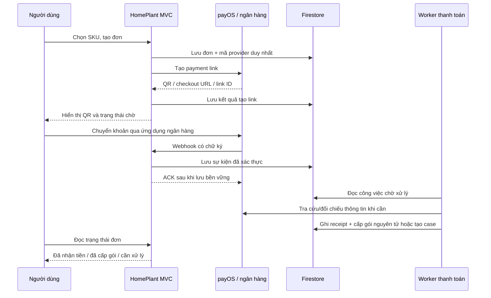

# HomePlant — Kế hoạch thanh toán thật qua QR ngân hàng

Cập nhật: **21/09/2026**. Trạng thái: **Kế hoạch để duyệt; chưa bật nhận tiền thật**.

Tài liệu tiếp nối `docs/COMMUNITY_SUBSCRIPTION_QR_PLAN.md` và dựa trên mã nguồn demo hiện đã có.

## Trạng thái thực hiện 21/09/2026

Đã hoàn thành lát cắt an toàn đầu tiên trong mã nguồn: policy dùng chung cho Disabled/Demo/Live; tách ranh giới theo deployment stage và Firebase project; live checkout fail-closed; simulator không thể xác nhận đơn Live; GET checkout không còn đổi trạng thái tài chính; order schema v2 có các trục checkout/payment/fulfillment/refund; entitlement demo dùng chung một policy; QR demo được kiểm tra chặt và checkout có sao chép, fallback ảnh, giờ Việt Nam cùng polling có backoff. Bộ `PaymentChecks` kiểm tra các ranh giới này mà không chứa thông tin tài khoản thật.

Chưa bật nhận tiền thật. Ảnh QR ngân hàng được cung cấp không thay thế Client ID/API Key/Checksum Key của payOS và không được đưa vào source. Staging chỉ được phép chạy simulator; các cờ live vẫn đóng cho đến khi hoàn tất onboarding, production project/host, pilot UID, chính sách hoàn tiền và duyệt hạ tầng luôn hoạt động.

**Cập nhật triển khai:** adapter SDK `payOS` 2.1.0, tạo/hủy checkout, mapping order code, endpoint webhook xác minh chữ ký, receipt/transaction/grant chống lặp và fulfillment live nguyên tử đã được bổ sung trong source. Return URL vẫn chỉ điều hướng giao diện. Tiền sai amount/currency/link/reference, tài khoản khóa hoặc xung đột hạng được lưu `NeedsReview` và không cấp quyền. Phần còn thiếu trước pilot gồm credentials/kênh payOS, đăng ký webhook, production project/host luôn hoạt động, reconciliation khi mất webhook, worker retry, admin review/audit và kiểm thử emulator/concurrency.

## 1. Phương án đề xuất

**Dùng payOS để nhận thanh toán QR theo từng đơn, backend HomePlant xác thực giao dịch rồi tự động kích hoạt/gia hạn gói.** Giữ ASP.NET Core MVC, Razor, Firebase Authentication và Firestore hiện tại.

Đây là lựa chọn kỹ thuật đề xuất, phụ thuộc ngân hàng nhận tiền và tài khoản của chủ dự án đủ điều kiện liên kết. Nếu chủ dự án đã dùng SePay hoặc bắt buộc có sandbox của nhà cung cấp, đánh giá SePay trước khi chốt. Chỉ tích hợp **một nhà cung cấp** trong đợt đầu.

| Phương án | Phù hợp với HomePlant | Điểm cần quyết định |
| --- | --- | --- |
| **payOS — đề xuất chính** | Có SDK .NET chính thức, payment link theo đơn, QR, webhook và tra cứu giao dịch | Không có sandbox riêng; cần liên kết đúng ngân hàng/tài khoản |
| SePay Payment Gateway | Có luồng checkout và sandbox riêng | Tích hợp REST; kiểm tra hợp đồng IPN và điều kiện merchant riêng |
| SePay Webhooks/API ngân hàng | Hợp khi muốn nhận biến động ngân hàng và tự quản lý việc khớp đơn | Có Test Mode; HomePlant phải làm nhiều logic khớp giao dịch hơn |

Các thông tin kỹ thuật trên đã đối chiếu với [SDK .NET payOS](https://payos.vn/docs/sdks/back-end/net/), [môi trường test payOS](https://payos.vn/docs/moi-truong-test/), [API SePay Gateway](https://developer.sepay.vn/vi/cong-thanh-toan/API/tong-quan) và [Test Mode SePay API ngân hàng](https://docs.sepay.vn/test-mode.html). Hai sản phẩm SePay có schema, xác thực và môi trường khác nhau; không dùng lẫn hướng dẫn.

**Chi phí:** payOS hiện công bố miễn phí khởi tạo/duy trì/giao dịch trên trang chủ. Đây không phải báo giá đã xác nhận cho tài khoản HomePlant; cần kiểm tra điều kiện ngân hàng, sản phẩm và phí phát sinh khi onboarding. Ngân sách còn có hosting luôn hoạt động, Firestore, AI và email. Không dựa vào bài viết giá cũ để cam kết chi phí. [Thông tin payOS hiện tại](https://payos.vn/)

## 2. Mục tiêu phát hành đầu tiên

Người dùng chọn gói → nhận QR đúng đơn → chuyển khoản bằng ứng dụng ngân hàng → HomePlant tự ghi nhận tiền và cấp quyền → người dùng xem được giao dịch và thời hạn mới.

Kết quả cần đạt:

- Nhận VND cho sáu SKU hiện có, giá do backend quyết định.
- Mỗi đơn chỉ cấp quyền một lần dù webhook lặp, mất mạng, người dùng đóng trình duyệt hoặc máy chủ restart.
- Giao dịch không khớp vẫn được ghi nhận và có hàng đợi xử lý; không bỏ mất tiền khách đã chuyển.
- Quản trị có thể đối soát và xử lý ngoại lệ với bằng chứng/audit.
- Có cơ chế dừng bán mới nhưng vẫn nhận và xử lý giao dịch của đơn cũ.

MVP không bao gồm tự trích nợ, hoàn tiền tự động qua API, nhiều cổng thanh toán, thẻ quốc tế, mã giảm giá, xuất hóa đơn điện tử tự động hoặc quy đổi Silver sang Gold giữa kỳ. QR chuyển khoản là **trả trước từng lần**; hết kỳ người dùng chủ động gia hạn.

## 3. Baseline thực tế và các điểm bắt buộc sửa

Khảo sát local ngày 21/09 đã thấy Catalog, Orders, DemoPaymentService, EntitlementService, Plans/Checkout/Subscription và bộ SubscriptionChecks. Không giả định chúng đã được triển khai/kiểm thử đầy đủ trên staging. Tài liệu kế hoạch demo cũ mô tả hiện trạng tại ngày 20/09, không còn là baseline mã nguồn mới nhất.

| File / hành vi hiện tại | Yêu cầu khi chuyển sang tiền thật |
| --- | --- |
| `SubscriptionOrderService.Create` luôn ghi `PaymentMode=Demo`, `IsDemo=true` | Chọn mode/provider theo cấu hình server; Disabled chặn tạo thanh toán; Live thiếu cấu hình phải fail closed |
| `DemoPaymentService.Confirm` chưa kiểm tra mode của chính đơn | Chặn tuyệt đối simulator xác nhận live order, kể cả có session và demo flag hợp lệ |
| `DemoPaymentService` gộp xác nhận và cấp gói | Tách tiếp nhận khoản tiền, kiểm tra giao dịch và fulfillment; giữ transaction cấp gói dùng chung |
| Hết hạn/hủy làm confirm từ chối hoàn toàn | Link không còn mở vẫn phải nhận và ghi giao dịch đến muộn để đối soát |
| `GetOwned` có thể đổi Pending thành Expired khi GET | Không để việc tải trang quyết định sự thật tài chính; thời hạn checkout khác thời điểm nhận tiền |
| Subscription/order_requests/pendingOrderId chưa được phân tách đầy đủ theo mode | Đơn/gói demo không chặn hoặc kéo dài subscription live; request key không trả nhầm đơn demo |
| `EntitlementService` bỏ qua demo ở Production nhưng Create đọc raw subscription; `UserPlantService.EffectivePlantLimit` và `AiQuotaService.EffectiveAiLimit` lặp logic riêng | Dùng một policy xác định gói hợp lệ cho create, fulfill, UI và quota |
| `EnforceLimits=false` hiện khiến một số đường thêm/xóa cây bỏ cập nhật counter | Luôn duy trì counter dù enforcement tắt; backfill/khởi tạo chính xác trước bật quota live |
| Reference hiện cắt ID rồi uppercase | Tạo mapping provider order code duy nhất, có transaction bảo đảm; không dò gần đúng theo reference/số tiền |
| `Program.cs` có anti-forgery toàn cục và `ActiveUserFilter` | Webhook riêng không phụ thuộc session; chỉ endpoint webhook miễn CSRF, thay bằng xác thực provider |
| Checkout chưa tự cập nhật trạng thái; view dùng `ToLocalTime()` | Poll có giới hạn/backoff; giờ hiển thị cố định Việt Nam; không hiện QR thanh toán trên đơn đã đóng |
| Test subscription hiện chủ yếu giá và thời gian | Bổ sung HTTP, signature, Firestore concurrency, provider timeout, reconciliation và phân tách demo/live |

Không sửa trực tiếp `IsDemo=false` để biến dữ liệu demo thành tiền thật. Local hiện chỉ thấy `global.json` chưa track; Agent phải kiểm tra lại Git trước khi làm, bảo toàn thay đổi của người dùng.

## 4. Quy tắc sản phẩm được kế thừa

| Gói | Giới hạn cây đã chốt | AI/tháng trong catalog hiện tại | Giá tháng | Giá 6 tháng trong catalog | Giá năm trong catalog |
| --- | ---: | ---: | ---: | ---: | ---: |
| Free | **2** | 3 | 0đ | — | — |
| Silver | **5** | 30 | **48.000đ** | 259.000đ | 489.000đ |
| Gold | **10** | 100 | **88.000đ** | 475.000đ | 899.000đ |

Giữ các giá/quota đang triển khai để tránh đổi scope. Việc chúng đã có trong code không thay thế quyết định thương mại: trước bán công khai, xác nhận lại giá dài hạn, quota AI, tổng tiền cuối cùng và chính sách dịch vụ. Không thêm phí bất ngờ tại checkout; snapshot catalog/điều khoản được lưu theo đơn.

- Gia hạn cùng hạng từ `max(activatedAt, currentLiveExpiresAt)`, tính theo tháng lịch như kế hoạch trước; không dùng ngày hết hạn demo.
- Khi cấp gói lần đầu, đề xuất bắt đầu ở `activatedAt` để khách không mất thời gian sử dụng nếu hệ thống xử lý chậm. Vẫn lưu riêng thời điểm ngân hàng ghi nhận tiền.
- Hạn mức AI theo tháng Việt Nam, không reset do thanh toán/gia hạn; kỳ 6/12 tháng không nhân quota tháng.
- Đổi hạng khi gói live khác còn hiệu lực bị chặn lúc tạo đơn. Nếu xung đột chỉ xuất hiện sau khi đã nhận tiền, giữ giao dịch và chuyển review.
- Hết gói giữ cây/lịch sử, áp giới hạn Free cho thao tác mới; không xóa dữ liệu đã có.
- Một đơn cấp quyền một lần. Chuyển hai lần vào cùng mã đơn không được hiểu là chủ động mua hai kỳ hạn.

## 5. Chuẩn bị tài khoản và môi trường

### Việc chủ dự án cần cung cấp hoặc hoàn tất

1. Chọn ngân hàng nhận tiền và loại chủ thể đăng ký (cá nhân/hộ kinh doanh/doanh nghiệp theo lựa chọn được nhà cung cấp hỗ trợ).
2. Tự hoàn tất định danh và liên kết ngân hàng trên hệ thống chính thức của nhà cung cấp; xác minh đúng tên người thụ hưởng. Không gửi mật khẩu ngân hàng, OTP hay ảnh giấy tờ cho Agent.
3. Tạo kênh thanh toán dành riêng cho HomePlant, cung cấp cấu hình qua nơi lưu secrets: Client ID, API Key, Checksum Key; không dán vào Git hoặc tài liệu công khai.
4. Chốt URL production, người chịu trách nhiệm xử lý thanh toán, kênh hỗ trợ và chính sách hoàn tiền/điều chỉnh quyền khi có hoàn tiền.
5. Duyệt ngân sách hosting luôn hoạt động và phép thử giao dịch thật cụ thể trước pilot.

Onboarding yêu cầu tài khoản merchant được xác thực và kênh thanh toán; ngân hàng khả dụng cần kiểm tra theo tài khoản thực tế, không hardcode một danh sách ngân hàng từ bài quảng cáo. [Hướng dẫn API payOS](https://payos.vn/docs/api/), [liên kết ngân hàng](https://payos.vn/docs/huong-dan-su-dung/ket-noi-tai-khoan-ngan-hang/)

### Ma trận môi trường đề xuất

| Môi trường HomePlant | Nguồn thanh toán | Dữ liệu | Quyền |
| --- | --- | --- | --- |
| Local test | Fake provider / webhook fixture dùng khóa test | Firestore emulator | Không nhận tiền thật |
| Staging demo | Simulator hiện có | Firebase staging | Chỉ demo, không gắn kênh live |
| Production pilot | payOS live, chỉ UID thử trong allowlist | Firebase production riêng | Có tiền thật; checkout chỉ mở cho người thử |
| Production public | Cùng live channel sau khi pilot đạt | Firebase production | Bán cho người dùng thực |

**payOS hiện không có sandbox riêng.** Do đó không gọi việc test có credentials payOS thật là “thử không mất tiền”. Test tự động dùng fake provider; pilot đầu-cuối là bước có tiền thật riêng, do chủ dự án chủ động thực hiện với số tiền/phạm vi đã duyệt. [Môi trường test payOS](https://payos.vn/docs/moi-truong-test/)

Ưu tiên pilot trên đúng hệ thống production nhưng chỉ mở cho tài khoản thử; đánh dấu `isPilot=true` để phân loại báo cáo, vẫn ghi nhận là tiền thật. Nếu cần số tiền thử nhỏ hơn SKU, dùng SKU kỹ thuật riêng đã duyệt, chỉ hiện cho UID pilot; không nhận amount tùy ý từ trình duyệt và không sửa giá gói công khai. Dữ liệu giao dịch pilot không được xóa sau test.

## 6. Kiến trúc trong ứng dụng hiện tại



| Thành phần | Trách nhiệm |
| --- | --- |
| `IPaymentProvider` + `PayOsPaymentProvider` | Tạo/tra cứu/hủy link, verify/chuẩn hóa dữ liệu đúng phiên bản SDK |
| `PaymentModePolicy` | Kiểm tra mode, stage, project, channel, pilot UID; dùng chung UI và service |
| `SubscriptionOrderService` | Lưu đơn/snapshot, pending lock, request identity và điều phối tạo link |
| `PaymentWebhookController` | Nhận webhook máy chủ, xác thực, lưu inbox và ACK |
| `PaymentIngestionService` | Một đường tiếp nhận từ webhook và reconciliation; dedup receipt, phân loại tiền nhận |
| `SubscriptionFulfillmentService` | Cấp/gia hạn theo receipt đã xác minh, transaction và grant duy nhất mỗi đơn |
| `PaymentProcessingWorker` | Xử lý inbox, retry, lease, phục hồi sau crash |
| `PaymentReconciliationService` | Tra provider cho đơn đang chờ/bất định, phát hiện thiếu giao dịch và tạo case |
| `AdminPaymentsController` | Xem giao dịch/ngoại lệ; đối soát lại; xử lý có audit và evidence |

Dùng SDK .NET chính thức, pin phiên bản và kiểm tra API thực tế trước viết adapter; tài liệu hiện dùng `PayOSClient`, `PaymentRequests.CreateAsync/GetAsync/CancelAsync`, `Webhooks.VerifyAsync/ConfirmAsync`. Không ghép mã mẫu `Net.payOS` cũ với SDK mới. [SDK .NET](https://payos.vn/docs/sdks/back-end/net/), [hướng dẫn chuyển phiên bản](https://github.com/payOSHQ/payos-lib-dotnet/blob/main/MIGRATION.md)

Worker có thể là `BackgroundService` trong cùng ứng dụng với queue/lease nằm ở Firestore để giảm hạ tầng. Process restart phải đọc lại việc còn dở. Chưa cần thêm Redis, Kafka hoặc microservice; nếu tách worker sau này thì giữ hợp đồng dữ liệu.

## 7. Dữ liệu: tách đơn, khoản tiền và quyền được cấp

| Collection / document đề xuất | Nội dung |
| --- | --- |
| `subscription_orders/{orderId}` | Snapshot SKU/giá/quota, UID, mode, provider/channel, schemaVersion=2, trạng thái checkout/payment/fulfillment, expiry, activation result |
| `payment_provider_orders/{channel_orderCode}` | Mapping duy nhất provider code → local order; được tạo trước gọi API |
| `payment_provider_links/{channel_linkId}` | Mapping link ID → local order, không cho một link gắn hai đơn |
| `payment_webhook_receipts/{receiptId}` | Dữ liệu chuẩn hóa đã verify, hash payload, version verification, receivedAt, processing state, attempts, nextAttemptAt, lease |
| `payment_transactions/{financialKey}` | Bằng chứng từng khoản chuyển: provider transaction/reference, channel, tài khoản nhận, amount/currency, occurredAt, firstSeenAt, orderId nếu khớp, allocation |
| `subscription_grants/{orderId}` | Một lần cấp quyền cho đơn: tier, thời hạn, catalog snapshot, transactionIds, activatedAt, grant status |
| `subscriptions/{uid}` | Projection gói live đang có hiệu lực; cập nhật cùng transaction với grant |
| `payment_cases/{caseId}` | Ngoại lệ, reason, order/transaction liên quan, owner xử lý, trạng thái, quyết định, refund reference nếu có |
| `payment_audit/{auditId}` | Hành động quản trị, actor UID, lý do, evidence, thay đổi trước/sau; không sửa lịch sử |
| `payment_reconciliation_runs/{runId}` | Cursor, thời điểm quét, số đơn/giao dịch lệch, lỗi và kết quả |

Giữ các collection billing/usage hiện có. Pending lock và idempotency key phải có scope UID + mode + channel. Một đơn active của live không được tái sử dụng bản demo cùng SKU. Không dùng TTL để xóa giao dịch tài chính; retention/backup phải được chủ dự án chốt trước public launch.

`financialKey` lấy từ định danh giao dịch ổn định theo provider + channel/merchant + transaction reference, mã hóa/hash để làm document ID. Webhook và API đối soát phải tạo ra **cùng khóa cho cùng khoản tiền**. Không dedup chỉ theo orderId/amount/time. Nếu provider thiếu định danh đủ chắc chắn, giữ NeedsReview, không tự coi là giao dịch mới.

Các trường bằng chứng khoản tiền là bất biến; allocation/refund là nghiệp vụ có audit riêng. Bảo đảm bằng transaction: tổng tiền đang phân bổ cho dịch vụ, phần đang giữ để hoàn và phần đã hoàn không vượt tiền nhận. Khi hoàn phần từng được phân bổ, việc nhả allocation phải gắn với quyết định điều chỉnh grant tương ứng; không tự bỏ quyền của đơn khác.

Lưu `providerOccurredAt`, giá trị thời gian gốc/timezone, `receivedAt`, `processedAt`, `activatedAt` riêng biệt. Dữ liệu tiền dùng integer VND. Dữ liệu nhạy cảm được giới hạn ở phần cần đối soát; không ghi raw body/secrets/tài khoản người chuyển đầy đủ vào application log. Nếu giữ payload gốc để điều tra, hạn chế truy cập và có retention riêng.

## 8. Trạng thái và quy tắc chuyển

Không tiếp tục dùng một trường `Status=Paid` để vừa biểu diễn nhận tiền vừa cấp gói.

| Trục | Các giá trị đề xuất | Ý nghĩa |
| --- | --- | --- |
| `checkoutStatus` | Initializing, CreateUnknown, Open, CancelRequested, Cancelled, Expired, Closed, CreateFailed | Link có thể thanh toán/đang tạo/đã đóng |
| `paymentStatus` | Unpaid, PartiallyReceived, ReceivedExact, ReceivedExcess, NeedsReview | Tiền đã ghi nhận và mức khớp với đơn |
| `fulfillmentStatus` | NotGranted, Granted, HeldForReview | Gói có được cấp hay chưa |
| `refundStatus` | None, Requested, Approved, InProgress, OutcomeUnknown, Completed, Rejected | Hoàn tiền theo case; không làm mất receipt gốc |

`ReceivedExact` là tổng tiền đã xác minh được gắn với đơn bằng amount dự kiến, nhưng không tự động đồng nghĩa đủ điều kiện auto-grant: MVP chỉ auto-grant một khoản chuyển đúng tiền, đúng đơn, đúng thời điểm và không có xung đột. Nhiều khoản cộng dồn đúng tiền chuyển review theo mục 12.

Adapter giữ cả `rawProviderStatus` và trạng thái nội bộ. Không suy diễn PROCESSING thành đã nhận tiền hoặc FAILED thành chắc chắn không có khoản chuyển; trạng thái chưa hỗ trợ phải đi qua xác minh/review. Hoàn tất bảng mapping theo phiên bản SDK trước tích hợp.

Một order đã Cancelled/Expired vẫn có thể nhận tiền; cập nhật paymentStatus và giữ lịch sử checkout. Quyết định auto-grant hay mở case dựa vào thời điểm chuyển tiền/hủy có hiệu lực theo mục 12, không chỉ trạng thái checkout hiện tại. Sau khi Granted, giao dịch mới cho cùng đơn được ghi riêng và vào case thanh toán lặp; không cấp thêm tháng. Refund hoàn thành là một giao dịch/ghi nhận điều chỉnh riêng, không xóa dấu vết tiền vào.

## 9. Tạo checkout thật, xử lý timeout và QR

1. POST tạo đơn kiểm tra login, account active, CSRF, rate limit theo UID/IP, live policy, SKU, subscription hiện tại. Server tra giá, không tin amount/UID/channel từ browser.
2. Transaction giữ local orderId, request key, pending lock và provider orderCode **trước khi gọi payOS**. Chọn mã số nguyên trong phạm vi SDK/API hỗ trợ và an toàn khi đi qua JSON/JavaScript; cấp bằng counter/mapping transaction, không chỉ dùng timestamp hoặc cắt chuỗi ID. Không dùng mã giao dịch mẫu của tài liệu.
3. Gọi Create bên ngoài transaction với tổng tiền, mô tả ngắn, return/cancel URL từ cấu hình HTTPS tin cậy và expiry. Không lấy public host từ request tùy ý, không nhúng PII vào description.
4. Xác minh response theo SDK, đối chiếu amount/currency/orderCode và người nhận; channel được ràng buộc bởi bộ credentials và endpoint đang dùng, không phải một field response payOS. Lưu `paymentLinkId`, `checkoutUrl`, `qrCode`, account snapshot đúng response. Link ID được bind duy nhất vào local order.
5. Render QR từ payload provider bằng thư viện QR phù hợp đã kiểm tra; có nút mở checkout chính thức làm fallback. Giữ nguyên số tài khoản, nội dung và QR do provider trả để hỗ trợ tài khoản định danh. Không tự ghép QuickLink theo số tài khoản khác hoặc tạo nội dung chuyển khoản mới.
6. Nếu Create timeout hoặc response chưa rõ, đặt `CreateUnknown`. Recovery GET theo mã đã giữ; không sinh mã/đơn mới vô điều kiện. Chỉ retry Create cùng mã sau khi provider contract cho phép và xác nhận chưa có link. Lỗi xác định trước tạo link mới là `CreateFailed`.
7. Nếu webhook đến trước lưu response Create, lưu inbox theo mapping orderCode đã có rồi tra cứu/bind link có kiểm chứng. Response đến muộn không được ghi đè payment/grant đã hoàn tất; dùng version/conditional updates.

API payOS có thao tác tạo/tra cứu/hủy link; Create trả QR và checkout URL, GET cho biết số tiền đã nhận và giao dịch. Không suy diễn header idempotency của API chi tiền sang API tạo link thu tiền. [API payOS](https://payos.vn/docs/api/)

Tổng thời hạn checkout đề xuất 15 phút, dùng thời gian server và expiry được provider xác nhận. UI hết giờ thì ngừng mời thanh toán và giải thích cách kiểm tra khoản đã chuyển; không cam kết QR cũ không còn nhận tiền.

Trước pilot phải có contract test xác nhận đơn vị `expiredAt`, timezone thời điểm giao dịch/hủy và các field có thể thiếu theo ngân hàng/API version. SDK hiện cho phép ExpiredAt ở response nullable; không giả định API luôn trả lại thời hạn. Lưu deadline đã gửi cùng bằng chứng provider chấp nhận/hỗ trợ; nếu chưa xác định được hiệu lực phía provider, hiển thị đó là hạn checkout HomePlant và xử lý thanh toán muộn theo policy. GET transaction hiện không có field currency riêng: kiểm tra VND từ nguồn đã xác thực/hợp đồng endpoint tương ứng, không tự đọc một field không tồn tại rồi retry vô hạn. Không suy đoán timezone từ máy chủ. [DTO payment chính thức](https://github.com/payOSHQ/payos-lib-dotnet/blob/main/src/Models/V2/PaymentRequests/PaymentRequestsModels.cs), [DTO webhook](https://github.com/payOSHQ/payos-lib-dotnet/blob/main/src/Models/Webhooks/WebhooksModels.cs)

## 10. Webhook: xác thực, lưu bền vững, ACK

Endpoint đề xuất: `POST /Payments/Webhooks/PayOS` trên HTTPS ổn định.

- Không yêu cầu session người dùng, cookie hoặc CSRF token. Miễn anti-forgery **chỉ action này**; giữ CSRF cho Create/Cancel/admin. Bỏ qua filter session/active-user ở endpoint server-to-server bằng metadata rõ ràng, không nới toàn bộ controller ứng dụng.
- Giới hạn kích thước body, validate schema; chọn channel/key từ cấu hình server của endpoint, không theo khóa bất kỳ do payload yêu cầu.
- Dùng verification của SDK đúng phiên bản. payOS ký dữ liệu theo quy tắc canonical hóa và HMAC-SHA256; không thay bằng raw-body HMAC của SePay. Chỉ các trường nằm trong phần đã xác thực được dùng làm bằng chứng; `success` bên ngoài payload không đủ để cấp quyền. [Quy tắc chữ ký payOS](https://payos.vn/docs/tich-hop-webhook/kiem-tra-du-lieu-voi-signature/)
- Lưu inbox chuẩn hóa đã xác thực bền vững trước ACK. Receipt lặp đã lưu trả 2xx; payload hỏng/chữ ký sai trả 400/401; storage lỗi trước lưu trả 503. Không ACK rồi mới cố lưu vào RAM.
- Business exception (sai tiền, đơn không tồn tại, tài khoản khóa) đã lưu thành case/inbox vẫn ACK 2xx; xử lý bất thường bằng nghiệp vụ, không bắt provider retry mãi.
- Khi đăng ký URL, provider có thể gửi giao dịch mẫu. Probe phải được ACK theo hợp đồng nhưng không tạo tiền thật hoặc grant. Chỉ chữ ký hợp lệ chưa đủ: cần link/receipt thực được tra cứu và liên kết đúng order. Không allowlist cố định `orderCode=123` như một đường cấp quyền. [API đăng ký webhook](https://payos.vn/docs/api/)
- Không dựa vào lịch retry giả định của provider; hệ thống tự có retry và reconciliation. Endpoint phải phản hồi nhanh sau durable write; mục tiêu nội bộ p95 dưới 2 giây khi hạ tầng bình thường, đo trước pilot.

Dedup gồm hai tầng: delivery trùng để giảm công việc và transaction reference trùng để ngăn tính tiền/cấp quyền hai lần. Hai payload khác nhau dùng cùng transaction ID phải tạo cảnh báo xung đột và review, không tự ghi đè bằng chứng cũ.

## 11. Xác minh khoản tiền và cấp gói

Worker claim inbox bằng transaction/lease. Ngoài transaction Firestore, lấy snapshot giao dịch từ provider khi cần; trong MVP nên tra GET để đối chiếu link, số tiền và receipt trước auto-grant. Nếu API đang lỗi, giữ “Đã nhận thông báo, đang xác minh”, retry; không coi là khách chưa chuyển tiền.

Điều kiện auto-grant:

1. Đơn tồn tại, mode Live và đúng provider/channel/project; dữ liệu đã verify, không phải probe/demo.
2. Order code và payment link khớp mapping duy nhất, số tiền dự kiến/currency từ snapshot không đổi.
3. Khoản chuyển là tiền vào người nhận được cấu hình/xác nhận, bao gồm mapping VA nếu provider dùng tài khoản định danh. Không so chuỗi VA với tài khoản gốc rồi loại giao dịch hợp lệ; kiểm tra đúng hợp đồng channel/provider.
4. Có reference giao dịch ổn định, chưa được phân bổ cho đơn khác; amount đúng bằng tổng đơn, VND. Không tự bù phí hay chấp nhận sai số tiền.
5. Xác định được tiền chuyển trong hạn và trước hủy có hiệu lực; tài khoản còn đủ điều kiện nhận dịch vụ, không có xung đột hạng/giao dịch.
6. Không có grant cho đơn. Nếu đã có grant, trả lại kết quả cũ, vẫn lưu thêm khoản tiền mới nếu có.

Transaction cấp quyền đọc order, receipt/mapping, user, gói live hiệu lực, grant, billing lock; ghi nguyên tử allocation khoản tiền, grant theo orderId, subscription projection, activation result và audit/event. Mọi luồng webhook, reconciliation, retry và xử lý case phải đi qua service này; không sửa subscription trực tiếp từ controller.

Đọc trước ghi; callback có thể retry nên tính `activatedAt` theo clock của attempt hợp lệ, không chụp một `now` cũ từ trước. Không gọi provider/email trong callback. Giao dịch Firestore đảm bảo một nhóm cập nhật cùng thành công hoặc cùng thất bại. [Firestore transactions](https://firebase.google.com/docs/firestore/manage-data/transactions)

Nếu API provider thấy một khoản tiền nhưng database đang lỗi, phải retry sau đó; nếu user bị khóa hoặc thiếu user record, ghi tiền và `HeldForReview`, không cấp dịch vụ và không bỏ receipt. Gửi thông báo/email sau commit nếu bổ sung, có idempotency riêng; email lỗi không đảo ngược thanh toán.

## 12. Chính sách ngoại lệ đề xuất để duyệt

| Trường hợp | Xử lý tiền | Xử lý quyền / UX |
| --- | --- | --- |
| Một khoản đúng tiền, đúng đơn, trong hạn | Ghi verified receipt, allocate một lần | Auto-grant; hiện thời hạn mới |
| Webhook đến muộn nhưng bank/provider xác nhận tiền vào trước expiry | Ghi thời điểm chuyển và nhận webhook riêng | Có thể auto-grant nếu không có hủy/xung đột; không dựa vào thời gian webhook tới |
| Không xác định chắc timezone/thời điểm giao dịch | Giữ dữ liệu gốc, tra cứu bổ sung | Review; không tự coi tiền là tới sớm/trễ |
| Chuyển sau expiry hoặc sau hủy có hiệu lực | Ghi nhận đầy đủ và tạo case | Chưa cấp tự động; admin đối soát, hỏi khách để cấp theo đơn cũ hoặc hoàn |
| Chuyển thiếu | Ghi PartiallyReceived | Chưa cấp; hướng dẫn liên hệ hỗ trợ. MVP không tự yêu cầu chuyển bù vào QR cũ |
| Nhiều khoản cộng lại đủ tiền | Ghi tất cả reference, không cộng trùng | Review để phân bổ đủ tiền rồi cấp đúng một lần; chưa tự gom tiền trong MVP |
| Chuyển thừa | Ghi ReceivedExcess và khoản dư | Review; cấp một gói sau khi duyệt, tạo phần tiền dư cần hoàn |
| Chuyển hai lần thật cho cùng đơn | Giữ hai receipt khác nhau | Một grant; khoản còn lại vào case, không gia hạn ngầm |
| Webhook lặp cùng khoản tiền | Không ghi doanh thu/receipt mới | Trả kết quả xử lý cũ |
| Sai/trống reference, không tìm thấy đơn | Ghi giao dịch chưa gắn đơn nếu có bằng chứng tin cậy | Review; không đoán người mua từ số tiền hoặc tên người chuyển |
| Sai người nhận/channel, tiền ra, chữ ký sai | Không phân bổ như tiền nhận hợp lệ của đơn | Không cấp quyền; ghi cảnh báo thích hợp |
| Account khóa, mất user hoặc tier conflict sau khi đã trả tiền | Ghi tiền và case | HeldForReview; không vứt khoản tiền, không tự gỡ khóa tài khoản |
| Provider báo Paid nhưng thiếu receipt/metadata mâu thuẫn | Tiếp tục tra cứu, giữ evidence | Pending verification/Review; không cấp dựa vào nhãn Paid duy nhất |
| Cancel chạy cùng lúc với payment | Dùng bằng chứng và thời điểm provider, bảo toàn cả sự kiện | Khoản đã trả đúng trước hủy được ưu tiên; không rõ thứ tự thì review |

Đề xuất vận hành: ngoại lệ có thông tin hỗ trợ/mã yêu cầu; người phụ trách phản hồi trong một ngày làm việc nếu chủ dự án có thể đáp ứng. Đây là mục tiêu cần duyệt, chưa phải cam kết hiển thị tự động.

**Hoàn tiền MVP:** quản lý yêu cầu và bằng chứng trong HomePlant; người phụ trách thực hiện chuyển hoàn bằng quy trình ngân hàng riêng. Hủy link không phải hoàn tiền. Không tích hợp API payout chỉ để hoàn trong đợt đầu; Agent không được tự thực hiện chuyển tiền.

Case hoàn phải có khoản gốc, số tiền còn có thể hoàn, người nhận đã đối soát, lý do, người duyệt, mã giao dịch hoàn và thời điểm. `Approved` chưa phải `Completed`; chỉ đánh dấu hoàn tất khi có bằng chứng khoản hoàn, chống đánh dấu/hoàn lặp bằng audit và kiểm tra tổng tiền đã hoàn. Không lấy tài khoản hoàn do request không xác thực cung cấp.

Trước chuyển hoàn thủ công, tạo refund intent với mã duy nhất và giữ số tiền cần hoàn bằng transaction trên khoản gốc, tính cả các case khác đang chờ. Khi không rõ ngân hàng đã chuyển thành công hay chưa, giữ intent ở `OutcomeUnknown`, tiếp tục giữ tiền và đối soát; không chuyển lần nữa chỉ vì chưa có trạng thái Completed. Chỉ giải phóng reservation khi xác nhận chắc giao dịch chưa thực hiện/đã hủy, hoặc chuyển reservation thành khoản đã hoàn khi có bằng chứng thành công. Trạng thái refund bổ sung `InProgress`/`OutcomeUnknown` cho hai bước này.

Quyền khi hoàn tiền: hoàn khoản dư/đúp chưa phân bổ không ảnh hưởng grant hợp lệ. Hoàn đơn đã cấp gói cần chính sách riêng được chủ dự án duyệt về phần đã sử dụng. MVP không tự trừ tháng trên subscription tổng, vì có thể làm mất kỳ hạn của đơn khác. Mọi điều chỉnh quyền phải tham chiếu grant tương ứng, có snapshot trước/sau và audit; chưa có chính sách thì giữ case mở để quyết định, không tự suy diễn.

## 13. Đối soát và phục hồi

Webhook là đường nhanh; reconciliation là đường phục hồi bắt buộc.

- Worker có queue/lease/checkpoint bền vững. Khi restart đọc lại Pending/Retry/lease hết hạn; retry có exponential backoff và jitter, giới hạn theo provider, không ngủ blocking trong HTTP request.
- Quét đơn Open, CreateUnknown, CancelRequested, pending verification và inbox lỗi theo `nextAttemptAt`; đề xuất chu kỳ điều phối 1–2 phút, điều chỉnh theo rate limit/chi phí thực tế.
- Ưu tiên đơn còn mở và vừa hết hạn; giảm tần suất khi đơn cũ. Có cửa sổ quét lại đơn gần đây và quy trình đối soát hàng ngày, không chỉ quét Pending.
- Mỗi lần GET provider đưa bằng chứng về cùng ingestion/fulfillment; không có đường “đối soát” ghi Paid hoặc gia hạn trực tiếp.
- Chỉ API tra từng payment link không bảo đảm thấy mọi khoản chuyển sai nội dung/không khớp đơn. Hàng ngày phải so đối chiếu báo cáo nhà cung cấp/sao kê của tài khoản nhận với ledger HomePlant; chưa có API liệt kê phù hợp thì làm bước này thủ công có record và người phụ trách.
- Dedupe theo receipt reference thống nhất; lưu checkpoint và quét chồng một khoảng thời gian để tránh bỏ sót ranh giới. Không coi một lần GET chưa thấy giao dịch là bằng chứng vĩnh viễn chưa nhận tiền.
- Khi hủy link, gọi provider rồi ghi kết quả có kiểm soát. Timeout hủy giữ CancelRequested, tra cứu lại; không kết luận chắc đã hủy. Browser `cancelUrl` chỉ cập nhật trải nghiệm, không tự đặt Cancelled.
- Có nút admin “Đối soát lại” với rate limit và audit; nút người dùng “Kiểm tra thanh toán” chỉ enqueue/đọc kết quả, không chứng minh đã chuyển tiền.

Cảnh báo vận hành: inbox chưa xử lý quá ngưỡng, verified payment chưa grant quá 5 phút, reconciliation không chạy >10 phút, lỗi chữ ký tăng, provider 429/5xx kéo dài, tiền chưa gắn đơn, duplicate reference khác payload. Ngưỡng là đề xuất nội bộ để hiệu chỉnh sau pilot, không là bảo đảm thời gian ngân hàng.

## 14. Giao diện người dùng và quản trị

### Checkout / tài khoản

- Hiện gói, kỳ hạn, tổng tiền cuối cùng, người nhận, QR và nội dung theo provider; cảnh báo kiểm tra người nhận trong ứng dụng ngân hàng.
- Trạng thái phân biệt “Chờ chuyển khoản”, “Đang xác minh”, “Đã nhận tiền — đang kích hoạt”, “Đã kích hoạt”, “Cần hỗ trợ”, “Hết thời gian thanh toán”. Không hiển thị success chỉ từ query string.
- Return URL chỉ đưa về trang trạng thái đơn thuộc người dùng; session hết thì login rồi quay lại. Dù khách đóng trang, worker vẫn cấp gói.
- Poll Status khoảng 3–5 giây khi tab đang xem, backoff khi lỗi/429, dừng khi kết thúc hoặc tab ẩn; không GET provider mỗi lần browser poll. Owner check và no-store ở mọi endpoint trạng thái/QR.
- Khi đơn đóng, ẩn QR/copy để tránh mời chuyển lại; nếu đã chuyển thì có nút kiểm tra và thông tin hỗ trợ. Lỗi kết nối không được kết luận “thanh toán thất bại, chuyển lại”.
- Lịch sử lưu đơn, từng giao dịch cần thiết, số tiền nhận/hoàn, thời điểm kích hoạt; hiển thị giờ Việt Nam rõ ràng. Biên nhận ứng dụng không tự gọi là hóa đơn điện tử.

### Quản trị tối thiểu

- Danh sách đơn/giao dịch/case có lọc ngày, trạng thái, mã đơn và provider reference; phân trang/cursor và indexes phù hợp.
- Xem giá đã chốt, khoản tiền thực nhận, kết quả verification/đối soát, grant và lịch sử thao tác; che bớt dữ liệu ngân hàng khi không cần đầy đủ.
- Cho “Đối soát lại”, “Gắn receipt chưa phân bổ với đơn”, “Duyệt xử lý/cấp gói từ khoản đã xác minh”, “Ghi nhận hoàn tiền có bằng chứng”.
- Quyền admin được kiểm tra server-side mỗi lần, POST có CSRF, lý do bắt buộc, idempotency và evidence. Không có nút tùy ý “Đánh dấu đã thanh toán” chỉ nhận orderId/amount từ form.
- Nếu team có nhiều người, tách người duyệt và người thực hiện hoàn; nếu chỉ một chủ dự án, ghi actor và thao tác rõ ràng. Không tự bật quyền quản trị cho tài khoản test.

## 15. Hạ tầng, cấu hình và rào chắn phát hành

**Production luôn hoạt động:** Render Free có thể ngủ sau 15 phút không truy cập, không phù hợp worker/đối soát liên tục cho tiền thật. Đề xuất web service trả phí luôn chạy và database production riêng; ngân sách được duyệt trước khi thay gói hosting. [Render Free](https://render.com/docs/free)

Đề xuất config, có options validation lúc startup:

```text
App__DeploymentStage=Production
App__PublicBaseUrl=https://<production-host>
Subscriptions__Enabled=true
Subscriptions__EnforceLimits=true
Payments__Mode=Live
Payments__Provider=PayOS
Payments__NewCheckoutsEnabled=false
Payments__DemoEnabled=false
Payments__PilotOnly=true
Payments__PilotUserIds__0=<approved-test-uid>
Payments__AllowedLiveProjectIds__0=<production-project-id>
Payments__PayOS__ChannelId=<internal-channel-id>
Payments__PayOS__ClientId=<secret>
Payments__PayOS__ApiKey=<secret>
Payments__PayOS__ChecksumKey=<secret>
Payments__OrderExpiryMinutes=15
```

Channel ID là định danh nội bộ gắn với bộ credentials và người nhận đã kiểm chứng, không phải trường tùy ý từ browser. Provider base URL chỉ tới host chính thức được phép; return/cancel URL được build từ public base URL cấu hình. Giữ secret/key rotation có version cho các receipt còn xử lý; không log key.

`NewCheckoutsEnabled=false` chỉ dừng đơn mới. Webhook, worker, đối soát, đọc subscription và xử lý các đơn đã tồn tại tiếp tục hoạt động. Không dùng `Mode=Disabled` như công tắc rollback làm dừng mọi khoản đang chuyển. Các mode/stage lạ bị từ chối; demo chỉ allowlist Local/Staging và project test.

Pilot UID allowlist chỉ giới hạn tạo checkout mới, không được làm rơi giao dịch của một đơn đã tạo hợp lệ khi UID bị rút khỏi danh sách sau đó. Việc khóa tài khoản vẫn được xử lý bằng HeldForReview.

Trước bật `EnforceLimits=true`, đối chiếu/backfill plantCount cho user cũ và khởi tạo 0 cho user mới có kiểm chứng. Chặn ghi cây trong cửa sổ sửa counter nếu cần; không coi counter thiếu ở user cũ là 0. Thêm/xóa vẫn cập nhật counter khi enforcement tắt để bật lại không lệch. Nghiệm thu quyền 2/5/10 cây và quota AI ngay sau live grant là điều kiện mở bán.

Bootstrap emulator phải tách hẳn khỏi credentials thật, cấu hình Firestore emulator rõ ràng; chỉ đặt `FIRESTORE_EMULATOR_HOST` không được coi là đã cô lập khi startup hiện còn nạp credential thực.

Production phải có rules/IAM server-only cho dữ liệu thanh toán và usage, backup/restore có thử nghiệm, health riêng của HTTP và worker, lưu Data Protection keys ổn định cho phiên đăng nhập. Session mất khi restart không được làm mất đơn hay kết quả thanh toán. Nếu tăng nhiều web instance, cần shared session hoặc cơ chế auth phù hợp; chưa cần scale ngay trong MVP.

Mã hiện dùng .NET 9. Microsoft công bố hết hỗ trợ .NET 9 ngày 10/11/2026; đề xuất hạng mục riêng nâng lên .NET 10 LTS trước/đồng thời chuẩn bị vận hành dài hạn, có regression và Docker image tương ứng. Không dùng bản preview cho live. [Chính sách hỗ trợ .NET](https://dotnet.microsoft.com/en-us/platform/support/policy/dotnet-core)

## 16. Kế hoạch triển khai cho Agent

| Chặng | Công việc | Điều kiện hoàn thành |
| --- | --- | --- |
| P0 — Chốt lựa chọn | Provider/ngân hàng, public host, giá/quota, chính sách ngoại lệ/hoàn, owner xử lý, ngân sách | Decision record; việc cần chủ dự án và việc Agent tự làm rõ ràng |
| P1 — Gia cố nền demo | Mode isolation, common entitlement policy, backend mode checks, counter initialization/backfill, emulator bootstrap, baseline tests | Simulator không cấp live order; gói demo không ảnh hưởng gói thật; quota sẵn sàng |
| P2 — Provider & tạo đơn | SDK adapter, unique mapping, snapshot, create/query/cancel, timeout recovery | Fake provider tests đạt; một request không tạo nhiều link không kiểm soát |
| P3 — Nhận tiền & cấp gói | Webhook verification, inbox/worker, transaction ledger, fulfillment/grant | Replay/race/crash không mất receipt hoặc cấp trùng |
| P4 — Ngoại lệ & đối soát | Reconciliation, cases, admin, audit, quản lý hoàn thủ công | Mất webhook được phục hồi; tiền thiếu/thừa/đúp đều có trạng thái xử lý |
| P5 — UX & hardening | QR provider, Status polling, return/cancel an toàn, logs/metrics/config, responsive | Giao diện nhất quán với server, không nhầm thanh toán với kích hoạt |
| P6 — Pilot live | Production riêng, credentials, webhook probe, giao dịch chủ dự án thực hiện | Bằng chứng ngân hàng/provider ↔ ledger ↔ grant khớp; restart/đối soát đạt |
| P7 — Mở bán | Chốt điều khoản hỗ trợ/hoàn, theo dõi, duyệt bật public checkout | Runbook/rollback và người chịu trách nhiệm sẵn sàng |

Ước lượng **8–12 ngày kỹ thuật**, chưa tính thời gian định danh/liên kết ngân hàng, quyết định thương mại và nâng hạ tầng/runtime. P2 adapter có thể làm song song UI theo interface; một Agent phụ trách schema/mapping, một Agent phụ trách webhook/worker sau khi contract chốt, một Agent phụ trách test độc lập. Không để nhiều Agent cùng sửa phương thức fulfillment transaction.

Không dựng lại module đăng ký từ đầu. Bổ sung/chỉnh chủ yếu ở `Services/SubscriptionOrderService.cs`, `DemoPaymentService.cs`, `EntitlementService.cs`, `Models/SubscriptionModels.cs`, `Controllers/CheckoutController.cs`, `Views/Checkout/*`, `Views/Subscription/*`, `Program.cs`, filters, options/indexes/test. Tạo mới provider/webhook/ingestion/fulfillment/reconciliation/admin/ledger theo mục 6–7. Tách cấu hình production khỏi `render.yaml` staging đang tồn tại.

## 17. Ma trận kiểm thử và tiêu chí nghiệm thu

### Tự động: fake provider + Firestore emulator + HTTP

| Nhóm | Ca bắt buộc |
| --- | --- |
| Auth/mode | Sửa amount/UID/channel; xem đơn người khác; CSRF; live thiếu key; Disabled; simulator gọi live order; demo expiry/pending/key không lẫn live |
| Provider Create | Timeout sau provider đã tạo; retry đồng thời; provider 429/5xx; response sai amount/link; webhook trước response Create; response tới muộn không ghi đè Paid |
| Signature | Đúng/sai key; payload sửa; JSON escaping/null/key order theo SDK; outer success giả; probe; key rotation; không dùng thuật toán provider khác |
| Durability | Storage lỗi trước ACK; crash sau ACK trước xử lý; crash giữa fulfillment; lease hết hạn/tác vụ cũ; hai worker cùng claim |
| Idempotency | 20 webhook cùng transaction; webhook + reconciliation đồng thời; cùng reference khác payload; hai khoản thật cho một đơn; receipt dùng lại ở đơn khác |
| Tiền và thời gian | Thiếu/thừa/nhiều khoản; currency sai; người nhận/VA sai; tiền ra; trống reference; payment trước expiry/webhook sau; sau expiry; cancel race; timezone thiếu |
| Subscription | Cấp lần đầu/gia hạn; cùng hạng; tier conflict; account khóa/mất; giữ thời hạn đơn khác; cùng tháng không reset AI; counter user mới/cũ và tắt/bật enforcement không lệch |
| Reconciliation | Bỏ webhook, API khôi phục; CancelUnknown/CreateUnknown; cursor/restart; provider tạm lỗi; đơn terminal vẫn thấy khoản đến muộn |
| Admin/refund | Không đủ quyền, thiếu evidence, double submit; hai case cùng giữ tiền hoàn; OutcomeUnknown không cho chuyển lại; phần dư hoàn không giảm gói đúng; Approved khác Completed; không sửa/xóa receipt gốc |
| UI | Return URL giả không cấp; đóng tab vẫn cấp; mất session/login lại; countdown hết không mất khoản đã trả; giờ VN; mobile; QR decode đúng payload |
| Rollback | Dừng tạo checkout mới nhưng callback/worker/đối soát đơn cũ vẫn hoạt động |

Không chỉ mock Firestore cho test nguyên tử: chạy concurrency test trên emulator. Mock provider tạo dữ liệu đã ký bằng key chỉ dành test, không dùng keys live trong CI. Pin fixture schema theo SDK; test fail rõ nếu contract thay đổi.

Chạy lại build và các checks hiện có: `RegistrationChecks`, `CareScheduleChecks`, `EmailNotificationChecks`, `SubscriptionChecks`, `npm --prefix Seed test`. Các project checks là executable; không coi `dotnet test` đơn lẻ là chạy được tất cả. Bổ sung lệnh chuẩn cho `PaymentChecks`/integration suite và ghi kết quả từng nhóm.

### Pilot có tiền thật — tách khỏi kiểm thử tự động

1. Chủ dự án hoàn tất merchant/channel/người nhận và cho phép phạm vi pilot cụ thể.
2. Endpoint nhận được webhook probe; dữ liệu mẫu không cấp quyền.
3. Tạo một đơn pilot đã duyệt và kiểm tra thông tin trên QR/app ngân hàng; chủ dự án tự thực hiện giao dịch.
4. Đối chiếu khoản vào từ provider/ngân hàng, reference, ledger, grant và UI; không chỉ dựa vào trang success.
5. Thử replay cùng callback bằng công cụ kiểm thử được phép, kiểm tra không gia hạn lại; không cần chuyển tiền lần nữa để thử replay.
6. Kiểm tra recover webhook bị trì hoãn bằng reconciliation và restart ứng dụng theo kế hoạch, không làm mất receipt.
7. Lưu báo cáo pilot, xử lý/ghi nhận hoàn nếu có theo quyết định chủ dự án. Giữ audit giao dịch thật.

**Definition of Done:** không có đường browser/simulator cấp live grant; không mất tiền đã nhận vì trạng thái order; không duplicate grant; provider/bank/ledger khớp trong pilot; vận hành xử lý được ngoại lệ; rollback vẫn tiếp nhận thanh toán đang dở; tài liệu config/test/runbook đầy đủ. Tests giả lập đạt chưa đủ để tuyên bố thanh toán thật đã nghiệm thu.

## 18. Triển khai, giám sát và rollback

1. Schema additive, code đọc được dữ liệu demo cũ; chuẩn bị indexes/backup trước bật live. Tốt nhất giữ production và demo ở hai Firebase project.
2. Deploy provider/webhook/worker với new checkouts tắt. Gắn channel, kiểm tra options validation, health và probe; verify đúng database.
3. Bật pilot UID allowlist, thực hiện mục 17; sửa lỗi và chạy lại test bị ảnh hưởng.
4. Trước public: đóng mọi case pilot chưa rõ, kiểm tra người nhận, phí/thỏa thuận nhà cung cấp, giá/quota, chính sách dịch vụ/hoàn và thông tin hỗ trợ. Không tự viết cam kết pháp lý/thuế thay chủ dự án.
5. Mở public checkout có người theo dõi; giám sát đối soát và grant latency trong 24–48 giờ đầu. Đây là bước vận hành sau khi được giao, tài liệu không tự tạo automation.
6. Có lỗi: tắt `NewCheckoutsEnabled`, ngừng hiển thị lời mời trả tiền mới; giữ webhook, ledger, worker và đối soát. Nếu cần dừng fulfillment do bug, vẫn nhận receipt bền vững và hiển thị đang xử lý; sửa rồi replay an toàn.
7. Không rollback về bản demo không hiểu receipt/live schema khi còn giao dịch đang dở. Chuẩn bị một bản live tối thiểu tương thích để nhận/đối soát trong thời gian sửa.
8. Không xóa đơn/receipt, đổi người nhận để né lỗi hoặc sửa trực tiếp subscription trong database. Mọi xử lý tiền và cấp quyền đi qua audit/service.

## 19. Các quyết định cần chủ dự án chốt

| Mã | Nội dung | Đề xuất |
| --- | --- | --- |
| L1 | Nhà cung cấp | payOS nếu ngân hàng/tài khoản phù hợp; SePay Gateway nếu ưu tiên sandbox |
| L2 | Ngân hàng/tài khoản nhận | Chủ dự án chọn, tự xác thực và liên kết |
| L3 | Cách thu | QR VND trả trước 1/6/12 tháng, gia hạn thủ công |
| L4 | Giá/quota public | Giữ catalog hiện tại; xác nhận giá dài hạn/quota AI trước bán |
| L5 | Tiền thiếu/thừa/trễ/đúp | Review thủ công có bằng chứng; chỉ auto-grant giao dịch bình thường |
| L6 | Hoàn tiền và quyền đã dùng | Hoàn thủ công trong MVP; chốt chính sách trước public |
| L7 | Production | Hosting luôn chạy + Firebase riêng + secrets riêng |
| L8 | Pilot | UID và số tiền cụ thể do chủ dự án duyệt; chủ dự án tự chuyển |

Có thể phát triển và kiểm thử fake provider trước khi có L2/credentials. Không được bật live checkout/tiến hành giao dịch thử chỉ vì mã nguồn đã xong. Chỉ cần người dùng cung cấp tên ngân hàng/dịch vụ để chốt hướng trước; thông tin tài khoản và secrets đặt vào cấu hình bảo mật ở giai đoạn triển khai.

## 20. Prompt bàn giao AI Agent

```text
Triển khai thanh toán thật cho HomePlant theo docs/LIVE_PAYMENT_PLAN.md
và các quyết định L1–L8 đã được chủ dự án duyệt. Đọc code hiện tại trước:
module demo đã tồn tại, không xây lại từ mô tả hiện trạng cũ ngày 20/09.

Giữ giới hạn cây Free 2 / Silver 5 / Gold 10 và catalog đã chốt. Tận dụng
MVC/Firestore; triển khai một provider. Tách đơn, receipt giao dịch và grant.
Đóng mọi đường simulator/browser có thể cấp live subscription trước khi
nối credentials thật. Không cộng ngày demo sang gói trả tiền.

Lưu order/mã provider trước gọi API, xử lý Create timeout và webhook sớm.
Webhook xác thực đúng SDK, lưu bền vững trước ACK, không phụ thuộc session.
Ingestion/fulfillment dùng chung cho callback, đối soát và admin; transaction
và idempotency phải chịu được replay/concurrency/restart. Không bỏ receipt
vì order hết hạn/hủy hoặc tài khoản bị khóa.

Hoàn thành cả reconciliation, case xử lý ngoại lệ, admin audit, UI trạng
thái và tests trong kế hoạch; không dừng ở tạo QR rồi đọc returnUrl.
Đặc biệt kiểm thử rollback dừng bán mới nhưng vẫn xử lý đơn đã có.

Phát triển bằng fake provider + emulator trước. Bảo toàn thay đổi có sẵn,
không dùng dữ liệu/secrets live cho test tự động. Nếu chọn payOS, ghi rõ
không có sandbox riêng; pilot có tiền thật là bước riêng do chủ dự án
thực hiện trong phạm vi đã duyệt. Không tự tạo tài khoản, liên kết ngân hàng,
mua hosting, chuyển/hoàn tiền hoặc bật bán công khai ngoài phạm vi được giao.

Bàn giao diff, tests đã chạy/bằng chứng, migration/indexes/options, runbook,
giới hạn còn lại và tiêu chí pilot. Không tuyên bố hoàn tất thanh toán thật
khi mới test fake provider hoặc chỉ có ảnh QR.
```
